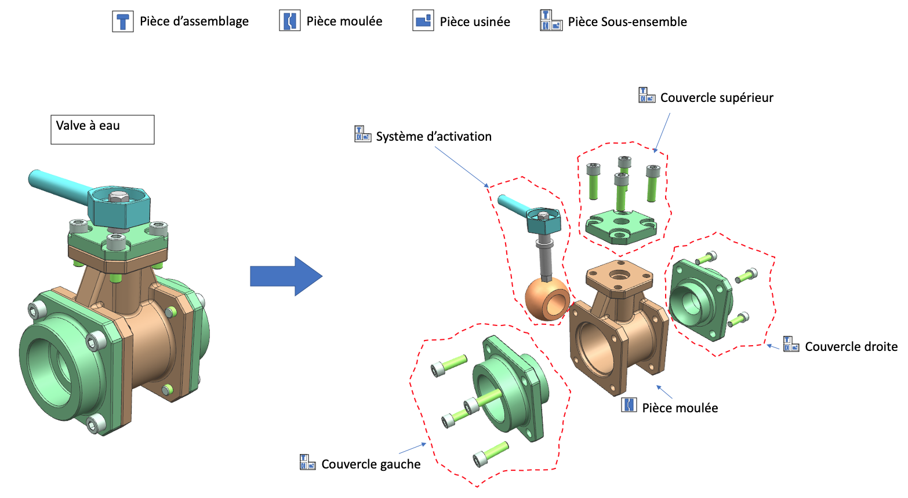

# Module 01 - Révisions

## Exercice 1 - Tasses

Un contenant peut contenir plusieurs liquides. Les liquides disponibles sont du lait, du café, de la crème et du chocolat.

Chaque liquide a un volume. Le volume total ne doit pas dépasser le volume du contenant moins 5%.

Les contenants disponibles sont du type bol ou tasse. Une tasse a un volume de 250ml. Un bol a un volume de 350 ml.

Un liquide peut être ajouté à un contenant tant que celui-ci n'est pas plein. Un contenant peut perdre du volume en le transférant (dans ce cas, chaque liquide perd un volume proportionnel au mélange initial).

Les contenants et les liquides doivent pouvoir être transformés facilement en chaînes de caractères afin, par exemple, de facilement être affichés :

- Pour un contenant, on extrait l'ensemble des liquides mélangés, le volume total maximum (capacité), le volume utilisé et le pourcentage de remplissage.
- Pour un liquide, on extrait son nom et son volume.

Modélisez le problème en faisant apparaître toutes les entités présentes dans le texte.

- Proposez un diagramme de classes
- Codez ces classes
- Faites des méthodes qui renvoient différents types de cafés dans différents types de contenants
- Faites les tests unitaires de la génération des chaînes de caractères
- Faites les tests unitaires de l'ajout d'un liquide dans une tasse et dans un bol

## Exercice 2 - Injection de dépendances

**Pour vous aider, regardez l'exemple donné dans ce répertoire : "POOII_M01_InjectionDependances"**

Dans cet exercice nous allons créer une interface `IJournal` qui définit les méthodes :

- `Information(string message)` qui permet de journaliser un message de type information
- `Avertissement(string message)` qui permet de journaliser un message de type avertissement
- `Erreur(string message)` qui permet de journaliser un message de type erreur

Nous allons ensuite créer les classes `ConsoleJournal`, `ConsoleJournalAvecHeure` et `FichierJournal` qui implémentent l'interface `IJournal`. 

La classe `ConsoleJournalAvecHeure` ajoute l'heure devant chaque message journalisé. 

La classe `FichierJournal` journalise les messages dans un fichier texte dont le nom est passé en paramètre du constructeur. De plus, chaque écriture se fait sur une nouvelle ligne avec la date, l'heure et le type de message. Exemples : "2024-09-29 17:17:04 - Information - L'application démarre", "2024-09-29 17:17:04 - Erreur - Impossible de se connecter à la base de données".

Dans les implantations sur la console, les messages de type information sont affichés en vert, les messages de type avertissement en jaune et les messages de type erreur en rouge. Ils sont aussi affichés sur le bon flux : standard pour les messages de types information et avertissement  (`Console.Out`) et erreur pour les messages de type erreur (`Console.Error`).

La classe `Application` qui prend en paramètre un objet de type IJournal dans son constructeur. Cette classe a une méthode Run qui affiche un message de type information, un message de type avertissement et un message de type erreur.

La classe `program` enregistre la classe `ConsoleJournal` ou `ConsoleJournalAvecHeure` ou `FichierJournal` pour l'interface `IJournal` et qui crée une instance de la classe `Application` en lui passant l'objet enregistré. Le choix de la classe doit être effectuée à partir de la configuration qui se trouve dans le fichier `appsettings.json`.

```json
{
  "journal": "ConsoleJournal"
}
```

Étapes à suivre :

- Créez la solution "POOII_M01_E02_DI" :
  - Créez un projet de type console "POOII_M01_E02_DI_Console"
  - Créez un projet de type bibliothèque de classes "POOII_M01_E02_DI_Journaux"
  - Créez un projet de type bibliothèque de classes "POOII_M01_E02_DI_Interfaces"
  - Ajoutez les références nécessaires :
    - "POOII_M01_E02_DI_Interfaces" (Projet) dans "POOII_M01_E02_DI_Console"
    - "POOII_M01_E02_DI_Journaux" (Projet) dans "POOII_M01_E02_DI_Console"
    - "Microsoft.Extensions.Hosting" (Nuget) dans "POOII_M01_E02_DI_Console"
    - "POOII_M01_E02_DI_Interfaces" (Projet) dans "POOII_M01_E02_DI_Journaux"
- Ajoutez les interfaces dans le projet "POOII_M01_E02_DI_Interfaces"
- Ajoutez les classes qui implante `IJournal` dans le projet "POOII_M01_E02_DI_Journaux"
- Ajoutez la classe `Application` dans le projet "POOII_M01_E02_DI_Console"
- Modifiez la classe `Program` pour enregistrer la classe `ConsoleJournal` ou `ConsoleJournalAvecHeure` ou `FichierJournal` pour l'interface `IJournal` et qui crée une instance de la classe `Application` en lui passant l'objet enregistré. Testez les différentes configuration
- Une fois vos tests manuels réalisés, créez le fichier "appsettings.json" à la racine du projet "POOII_M01_E02_DI_Console" :
  - Copiez / collez le contenu du code JSON présenté plus haut
  - À partir de l'explorateur de solution, faites un clic droit sur le fichier et choissisez "Propriétés" (*Properties*). Dans les propriétés, placez-vous au niveau de la propriété "Copier dans le répertoire de sortie" (*Copy to Output Directory*) et choisissez "Toujours copier" (*Copy always*) (Pour valider le fonctionnement, après la prochaine génération du projet, le fichier `appsettings.json` se trouvera dans le répertoire de sortie à côté de votre fichier exécutable).
- Modifiez votre code pour tenir compte de la configuration en prenant le projet démonstration en exemple
- Testez différentes configurations

## Exercice 3 - Linq

Dans cet exercice, vous allez réviser/apprendre les bases de Linq.

### Exercice 3.1 - Linq sur des entiers

- Créez la solution "POOII_M01_E03_Linq" avec le projet de type console "POOII_M01_E03_Linq_Console"
- Créez la liste d'entiers `nombres` qui contient les nombres de 1 à 100
- Affichez les nombres de 1 à 100 en une ligne de code (utilisez `string.Join`)
- Effectuez les requêtes LinQ suivantes :
  - Affichez les nombres pairs en une ligne de code (utilisez `string.Join`, `Where`)
  - Affichez les nombres impairs en une ligne de code (utilisez `Where` et `ForEach`)
  - Affichez les valeurs de 3 à 300 de 3 en 3 à partir de la liste `nombres` (utilisez `Select` et `string.Join`)

### Exercice 3.2 - Linq sur des objets

- Récupérez les fichiers du répertoire Linq. Ils contiennent une liste de produits que vous pouvez récupérer avec la méthode `DonneesLINQ.CreateProductList`, ainsi que la classe `ObjectDumper` qui permet d'afficher les objets de manière plus lisible avec la méthode `Write`. Ajoutez ces fichiers à votre projet.
- Effectuez les requêtes LinQ suivantes :
  - Affichez la liste des produits triés par prix (utilisez `OrderBy` et `ObjectDumper.Write`)
  - Affichez la liste des produits dont le nom contient `z` (utilisez `Where` et `ObjectDumper.Write`)
  - Affichez la liste des produits dont le prix est supérieur à 100 (utilisez `Where` et `ObjectDumper.Write`)
  - Affichez la liste des noms de produits dont le prix est supérieur à 100 et dont le nom contient `z` (utilisez `Where` et `ObjectDumper.Write`)
  - Affichez le produit le plus cher (utilisez `OrderBy` et `First` et `ObjectDumper.Write`)
  - Affichez le produit dont l'identifiant est `23` (utilisez `Where` et `Single` et `ObjectDumper.Write`)
  - Affichez le produit dont l'identifiant est `123` (utilisez `Where` et `SingleOrDefault` et `ObjectDumper.Write`)
- Répondez aux questions suivantes :
  - Quelle est la différence entre `Single` et `SingleOrDefault` ?
  - Quelle est la différence entre `First` et `FirstOrDefault` ?
  - Quelle est la différence entre `Single` et `First` ?

### Exercice 3.3 - Aller plus loin

-  https://github.com/dotnet/try-samples/tree/main/101-linq-samples
- 

## Exercice 4 - Assemblage (Optionnel)

Une pièce est composée de 0 ou de plusieurs autres pièces. Une pièce peut être soit de type pièces d'assemblage (vis, rivêts), soit de type moulée ou de type usinée.

Chaque pièce a une description, un numéro de série et une référence. Chaque pièce peut être transformée en chaînes de caractères. Chaque pièce se décrit et demande aux pièces qui le composent de se décrire.

Afin de rendre compte de la hiérarchie des pièces (pièces composées de pièces, etc.), les chaînes doivent être préfixées par des espaces dépendants de leur niveau. (2 espaces par niveau)

Exemple basé sur l'illustration proposée par Eder Rafael Do Monte Melo ([fichier PowerPoint plus détaillé](Illustration_Piece_Eder/Assemblage.pptx)) :



```console
Pièce : Valve à eau, part - #1234, numéro série -  #0481
  Pièce : Base, part - #1387, numéro série -  #0474
  Pièce : Système d'activation, part - #1887, numéro série -  #0574
    Pièce : Pin, part - #1687, numéro série -  #0974
    Pièce : Plug, part - #1657, numéro série -  #0964
    Pièce : Poigné, part - #3157, numéro série -  #2547
  Pièce : Couvercle latérale, part - #1987, numéro série -  #0374
    Pièce : Couvercle Monobloc, part - #1257, numéro série -  #9874
    Pièce : Visse M8, part - #8757, numéro série -  #3774
    Pièce : Visse M8, part - #8757, numéro série -  #3774
    Pièce : Visse M8, part - #8757, numéro série -  #3774
    Pièce : Visse M8, part - #8757, numéro série -  #3774
  Pièce : Couvercle latérale, part - #1987, numéro série -  #0374
    Pièce : Couvercle Monobloc, part - #1257, numéro série -  #9874
    Pièce : Visse M8, part - #8757, numéro série -  #3774
    Pièce : Visse M8, part - #8757, numéro série -  #3774
    Pièce : Visse M8, part - #8757, numéro série -  #3774
    Pièce : Visse M8, part - #8757, numéro série -  #3774
```

**Pour les plus téméraires** : écrivez une méthode qui, à partir du pièce, renvoie sa nomenclature (BOM : Bill of Materials)

Toujours avec le même exemple :

```console
Description                             Référence  Nombre
Valve à eau                             1234       1
Couvercle Monobloc                      1257       2
Base                                    1387       1
Plug                                    1657       1
Pin                                     1687       1
Système d'activation                    1887       1
Couvercle latérale                      1987       2
Poigné                                  3157       1
Visse M8                                8757       8
```
