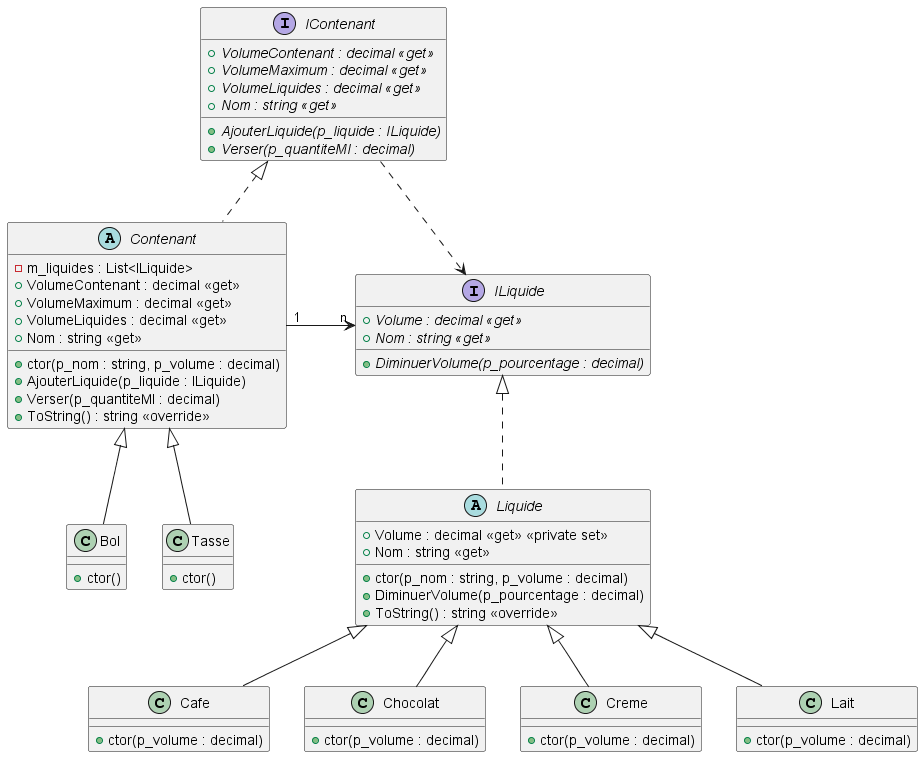
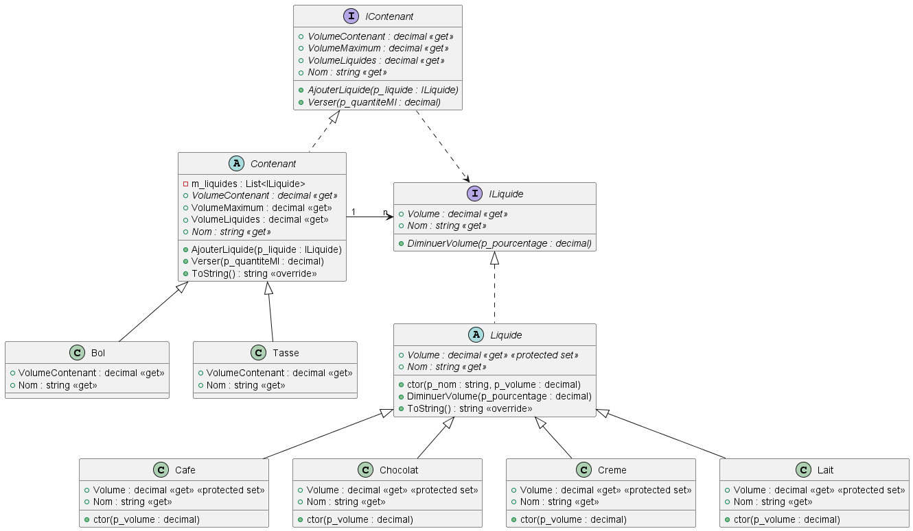
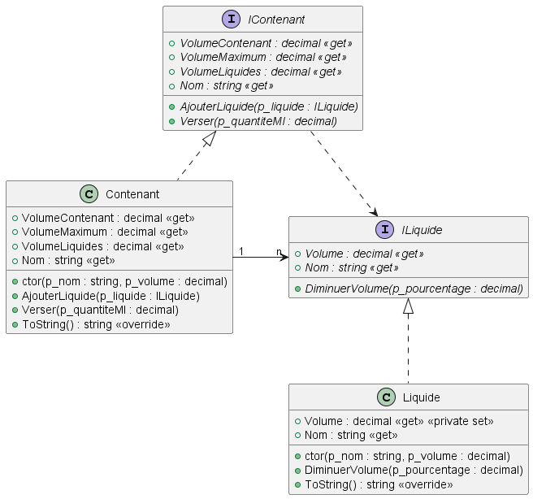

# Exercice 1 - Tasses

## Version 1

Ici on explicite les contenants et les liquides. Ajouter un contenant ou un liquide revient à créer de nouvelles classes. Les valeurs de noms et de volumes sont données par les constructeurs par défaut des classes filles qui appellent le constructeur d'initialisation de la classe mère.

## Version 2

Ici on explicite les contenants et les liquides. Ajouter un contenant ou un liquide revient à créer de nouvelles classes. Les valeurs de noms et de Volume sont données par défaut par les propriétés redéfinies dans les classes filles.

## Version 3

Ici on cherche à rester très générique. L'ajout de contenants ou de liquides ne nécessite pas de changer de code.

