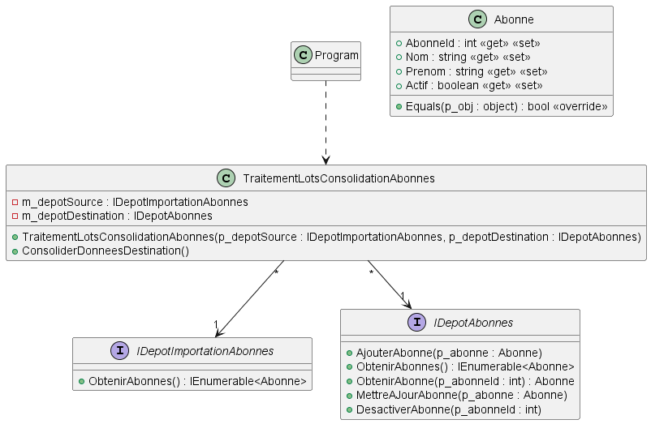

# Module 02 - Tests unitaires

## Exercice 1 - Questionnaire

Reprendre le code présent dans le même répertoire que le fichier d'exercices.

***La correction partielle est dans la solution, ne la consultez pas tout de suite !***

1. Créez un nouveau projet de tests XUnit et appelez le "Tests_Perso_POOII_Module02_TestsUnitaires" et liez le projet à tester
2. Installez les paquets NuGet "Moq" et "Fluent assertion"
3. Testez les méthodes et propriétés, en validant le nombre d'appels et le non appel des méthodes/propriétés non essentielles :
   1. CorrigerQuestions
   2. TotalPoints
   3. Score
   4. PoserQuestions
4. Modifiez le code de PoserQuestions afin que celui-ci appelle plusieurs fois la méthode PoserQuestion des questions. Validez que certains de vos tests échoues.
5. Modifiez le code de PoserQuestions afin que celui-ci appelle d'autres méthodes et propriétés des questions. Validez que certains de vos tests échoues.

## Exercice 2 - Consolidation d'un dépôt de données

Vous devez écrire un programme ("TraitementLotsConsolidationAbonnes") qui met à jours le dépôt de données destination contenant des abonnées à partir d'un autre dépôt de données source.

### Description

Le dépôt source est représenté par l'interface "IDepotImportationAbonnes" qui ne comporte qu'une méthode "ObtenirAbonnes" qui renvoie un "IEnumerable<Abonne>". Le dépôt destination est représenté par l'interface "IDepotAbonnes" qui comporte les quatre méthodes de CRUD ainsi qu'une méthode qui renvoie tous les abonnements :

- "AjouterAbonne" : ajoute un abonné actif au dépôt
- "ObtenirAbonne" : renvoi un abonné quelque soit son statut
- "ObtenirAbonnes" : renvoi tous les abonnés actifs
- "MettreAJourAbonne" : met à jour les informations d'un abonné actif
- "DesactiverAbonne" : modifie le statut d'un abonné actif pour le mettre à faux

Le schéma UML suivant résume ce qui touche à "TraitementLotsConsolidationAbonnes".

L'algorithme de consolidation des données fonctionne comme suit :

- Si un abonné est présent dans la source mais pas dans la destination, il faut l'ajouter dans la destination
- Si un abonné est présent dans les deux dépôts, il faut vérifier si ses données sont égales. Si ce n'est pas le cas, on doit mettre à jour le dépôt destination
- Si un abonné est présent dans la destination mais pas dans la source, il est désactivé dans la destination

### À faire

- Créez un nouveau projet nommé "M02_UT_ConsolidationAbonnes" de type console
- Codez les classes du diagramme :
  - La fonction "main" va ici rester vide
  - La classe "Abonne" ne contient pas de logique, seulement des propriétés et la méthode "Equals" qui est à redéfinir. La méthode "Equals" ne tient pas compte de l'état "Actif"
  - Les interfaces se suffisent à elle-même ici : on ne veut pas les implanter
  - Laissez la méthode "ConsoliderDonneesDestination" de la classe "TraitementLotsConsolidationAbonnes" vide pour le moment.

Pour chacun des cas de test qui suivent, vous devez :

- Analysez sur papier le cas de test suivant :
  - Quels sont vos ensembles de données source et destination ?
  - Quels méthodes devraient être appelées ?
- Écrivez un test unitaire qui permet de tester la méthode "ConsoliderDonneesDestination" avec le cas de test courant
- Codez la méthode "ConsoliderDonneesDestination" afin de faire passer le test avec un minimum d'efforts

Cas de test :

1. La source contient un abonné et la destination n'en contient pas.
2. La source ne contient pas d'abonné et la destination contient un abonné.
3. La source et la destination contiennent le même abonné avec les mêmes informations
4. La source et la destination contiennent le même abonné avec un prénom différent
5. La source contient 3 abonnés, un qui n'existe pas dans la destination, un qui est égale à la destination, un qui est différent sur les données du prénom. La destination contient un abonné de moins que la source.
