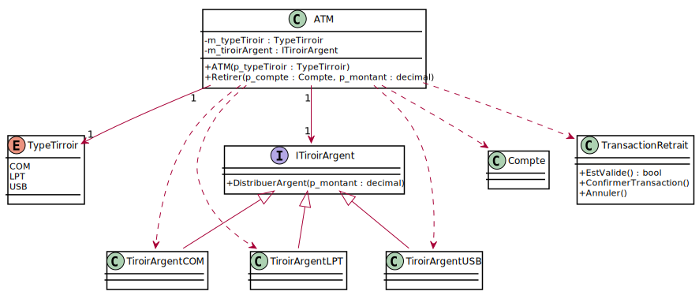
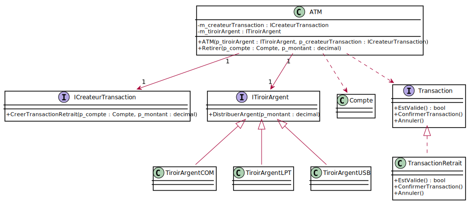

# Module 04 - Principes SOLID

Pour les exercices suivants, débutez par la création d'un diagramme de classes.

Discutez des améliorations possibles entre vous. Mettez-vous à la place du client : essayez de déduire ce qu'il voudrait.

Essayez de prévoir les modifications futures.

Pour ces exercices, vous avez le temps, le partage des idées doit prendre plus que 5 mins.

## Exercice 1 - Améliorer les interfaces

Soit le code suivant qui est installé dans une application de tableau de bord de véhicule :

```csharp
public interface Vehicule {
    double ObtenirVolumeRestantReservoirEnGallon();
    double ObtenirVolumeRestantReservoirEnLitre();
}
```

Proposez une meilleure interface que celle présentée en vous posant les bonnes questions, c'est en dire en vous mettant à la place du besoin que vous supposez de l'utilisateur.

<details>
    <summary>Indice #1</summary>
Qu'est-ce qu'un véhicule ? Comment se déplace-t-il ?
</details>

<details>
    <summary>Indice #2</summary>
Que veut généralement savoir l'utilisateur de cette application ?
</details>

<details>
    <summary>Proposition de solution #1</summary>

``` csharp
public interface Vehicule
{
    double ObtenirPourcentageEnergieRestante();
}
```
</details>

<details>
    <summary>Proposition de solution #2</summary>

```csharp
public interface Vehicule
{
    double ObtenirNombreKmRestants();
}
```
</details>

## Exercice 2 – Et si on faisait de l’orientée objets ?

Que dire de la classe Automobiliste ? Comment l'améliorer ?

```csharp
public interface Voiture
{
    TypeVoiture GetTypeVoiture();
    void RemplirReservoir();
    void Brancher();
    void AjouterEau();
    void AjouterCharbon();
}

public class Automobiliste {
    private Voiture m_voiture;
    
    public void Remplir()
    {
        switch (m_voiture.GetTypeVoiture())
        {
            case TypeVoiture.ESSENCE:
                this.m_voiture.RemplirReservoir();
                break;
            case TypeVoiture.ELECTRIQUE:
                this.m_voiture.Brancher();
                break;
            case TypeVoiture.SOLAIRE:
                break;
            case TypeVoiture.VAPEUR:
                this.m_voiture.AjouterEau();
                this.m_voiture.AjouterCharbon();
                break;
            default:
                break;
        }
    }
    
    // ...
}
```

<details>
    <summary>Indice #1</summary>
Que dire d'un voiture qui roulerait à l'hydrogène ?
</details>

<details>
    <summary>Indice #2</summary>
Quel(s) principe(s) sont violés ici ?
</details>

<details>
    <summary>Proposition de solution #1</summary>

``` csharp
public interface Voiture
{
    void AjouterEnergie();
}

public class Automobiliste
{
    private Voiture m_voiture;
    
    public void AjouterEnergie()
    {
        this.m_voiture.AjouterEnergie();
    }
    // ...
}

```
</details>

## Exercice 3 – Détecter les dépendances et les minimiser

Quelles sont les dépendances ? Que pouvez-vous dire du constructeur et de la méthode "Retirer" ?

Comment pourriez-vous améliorer le code ?

```csharp
public class ATM {
    private TypeTirroir m_typeTiroir;
    private ITiroirArgent m_tiroirArgent;

    public ATM(TypeTirroir p_typeTiroir) {
        this.m_typeTiroir = p_typeTiroir;
        switch (this.m_typeTiroir)
        {
            case TypeTiroir.COM:
                this.m_tiroirArgent = new TiroirArgentCOM();
                break;
            case TypeTirroir.LPT:
                this.m_tiroirArgent = new TiroirArgentLPT();
                break;
            case TypeTirroir.USB:
                this.m_tiroirArgent = new TiroirArgentUSB();
                break;
            default:
                break;
        }
    }

    public void Retirer(Compte p_compte, decimal p_montant)
    {
        TransactionRetrait transaction = new TransactionRetrait(p_compte, p_montant);
        if (transaction.EstValide()) {
            try
            {
                transaction.ConfirmerTransaction();
                this.m_tiroirArgent.DistribuerArgent(p_montant);
            }
            catch (Exception ex)
            {
                transaction.Annuler();
            }

        }
    }
    
    // ...
}
```

<details>
    <summary>Indice #1</summary>
Que dire du "selon cas" ("switch") qui apparait dans le constructeur ?
</details>

<details>
    <summary>Indice #2</summary>
Quel(s) principe(s) sont violés ici ? Validez les dépendances.
</details>

<details>
    <summary>Indice #3</summary>



</details>


<details>
    <summary>Proposition de solution #1</summary>

``` csharp
public class ATM
{
    private ICreateurTransaction m_createurTransaction;
    private ITiroirArgent m_tiroirArgent;

    public ATM(ITiroirArgent p_tiroirArgent, ICreateurTransaction p_createurTransaction)
    {
        this.m_createurTransaction = p_createurTransaction;
        this.m_tiroirArgent = p_tiroirArgent;
    }

    public void Retirer(Compte p_compte, decimal p_montant)
    {
        ITransaction transaction = this.m_createurTransaction.CreerTransactionRetrait(p_compte, p_montant);
        if (transaction.EstValide())
        {
            try
            {
                transaction.ConfirmerTransaction();
                this.m_tiroirArgent.DistribuerArgent(p_montant);
            }
            catch (Exception ex)
            {
                transaction.Annuler();
            }

        }
    }
    
    // ...
}

```



</details>

## Exercice 4 – Conception - Imaginez votre ATM (Optionnel)

Vous devez effectuer la conception d'un guichet automatique.

Ce guichet permet de :

- Retirer de l'argent
- Déposer de l'argent
- Faire un transfert d'un compte vers un autre compte

Il y a trois types d'interface utilisateur :

- Graphique
- Braille
- Vocale

Effectuez le diagramme de classe d'un tel guichet en débutant par les opérations à réaliser et les interfaces.

Essayez de rajouter le concept de banques et de succursales. Faites des diagrammes dynamiques afin de vous aider à valider votre conception (ex. : diagrammes de séquence ou diagrammes d'objets)
