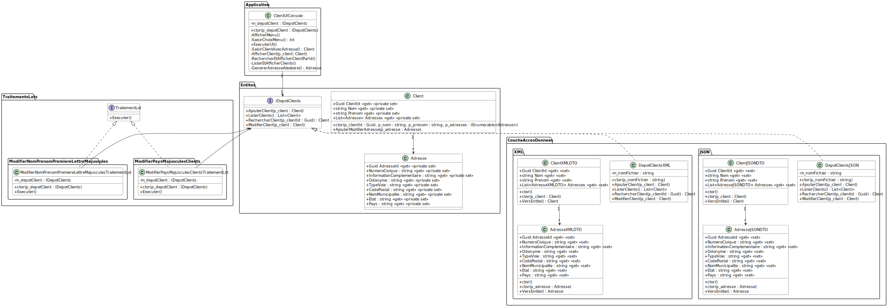

# Module 06 - Formats d'échanges

## Exercice 1 - Clients

---
**NOTE**

Pour cet exercice, suivez le modèle donné en cours. La compréhension du modèle proposé sera plus grande après le Module 08.

Les principaux buts sont :

- Manipuler des fichiers
- Manipuler un format XML
- Manipuler un format JSON
- Suivre un design d'application
- Renforcer la notion d'interface
- Renforcer la notion de polymorphisme
- Appliquer l'injection de dépendances
- Commencer à comprendre un design d'application plus complexe

---

Un client est défini par :

- Un identifiant de type Guid
- Un prénom et un nom
- Une liste d'adresses

Une adresse est définie par :

- Un identifiant de type Guid
- Un numéro civique
- Une information complémentaire (app, etc.) de type chaîne
- Un odonyme
- Un type de voie
- Code postal
- Nom municipalité
- État
- Pays

1. Implantez les classes nécessaires à représentation d'un client.
2. Écrivez une interface de type dépot qui permet d'ajouter un client, effectuer la recherche d'un client par son identifiant et lister tous les clients.
3. Écrivez deux classes qui implante l'interface précédente et qui implantent  respectivement un dépot de type XML (le format est libre) et un dépôt JSON.
4. Créez une application console qui permet de manipuler un dépôt à l'aide d'un menu. L'application console doit être codée dans la classe "ClientUIConsole". Elle reçoit le dépôt au moment de son initialisation.
Afin de simplifier l'écriture du code, la saisie de l'adresse peut-être simulée par une méthode qui renvoie des adresses aléatoires.
5. Utilisez l'injection de dépendances, revoir exercice [Module 1](../Module01_Revisions/Module01_Revisions_Exercices.md)
6. Dans l'interface de dépot clients, ajoutez une méthode qui permet de modifier un client.
7. Créez une interface "TraitementLot" qui contient seulement la méthode "Executer" qui ne prend pas de paramètre et ne renvoie rien
8. Créez une autre classe "ModifierNomPrenomPremiereLettreMajusculesTraitementLot" qui implante l'interface précédente. Le traitement parcours la liste de clients et doit modifier leur nom et/ou prénom s'ils l'un d'eux ou les deux ne débutent pas par une majuscule. Dans le cas contraire, ils ne doivent pas être enregistrés.
9. Créez une classe "ModifierPaysMajusculesClientsTraitementLot" qui implante l'interface précédente. Le traitement parcours la liste des clients et convertir l'ensemble des pays des adresses en majuscules si ce n'est pas déjà le cas. Dans le cas contraire, ils ne doivent pas être enregistrés.
10. Testez les deux précédents traitements. Utilisez des Moq afin de valider que les méthodes de sauvegarde ne sont pas appelées pour rien.

<details>
    <summary>Proposition de diagramme de classes</summary>


</details>

<details>
    <summary>Proposition de diagramme de packages</summary>


</details>

<details>
    <summary>Injection de dépendances, solution partielle</summary>

Inspirez-vous du code suivant :

```csharp
HostApplicationBuilder builder = Host.CreateApplicationBuilder(args);
builder.Services.AddScoped<TraitementLot.ModifierNomPrenomPremiereLettreMajuscules.ModifierNomPrenomPremiereLettreMajusculesTraitementLot>();
builder.Services.AddScoped<TraitementLot.ModifierPaysMajusculesClients.ModifierPaysMajusculesClientsTraitementLot>();
builder.Services.AddScoped<ClientUIConsole>();

builder.Services.AddScoped<IDepotClients, DepotClientsJSON>(serviceProvider => new DepotClientsJSON(_fichierDepotClientsJSON));
// Ou
//builder.Services.AddScoped<IDepotClients, DepotClientsXML>(serviceProvider => new DepotClientsXML(_fichierDepotClientsXML));

IHost host = builder.Build();

ITraitementLot traitementLot = null;
using (IServiceScope scope = host.Services.CreateScope())
{
    traitementLot = scope.ServiceProvider.GetService<TraitementLot.ModifierNomPrenomPremiereLettreMajuscules.ModifierNomPrenomPremiereLettreMajusculesTraitementLot>();
    traitementLot.Executer();
}

using (IServiceScope scope = host.Services.CreateScope())
{
    traitementLot = scope.ServiceProvider.GetService<TraitementLot.ModifierPaysMajusculesClients.ModifierPaysMajusculesClientsTraitementLot>();
    traitementLot.Executer();
}

using (IServiceScope scope = host.Services.CreateScope())
{
    ClientUIConsole clientUIConsole = scope.ServiceProvider.GetService<ClientUIConsole>();
    clientUIConsole.ExecuterUI();
}
```

</details>

<details>
    <summary>Tests unitaires avec Moq, solution partielle</summary>

Inspirez-vous du code suivant :

```csharp
[Fact]
public void Executer_2Clients3Adresses2AModifier_TousEnMaj()
{
    Mock<IDepotClients> mockDepot = new Mock<IDepotClients>();
    mockDepot.Setup(m => m.ListerClients()).Returns(new List<Client>()
    {
        new Client(Guid.NewGuid(), "Nom1", "Prenom1", new List<Adresse>()
        {
            new Adresse(Guid.NewGuid(), 100, "", "ODO", "Voie", "CP", "Muni", "Etat", "Pays1"),
            new Adresse(Guid.NewGuid(), 100, "", "ODO", "Voie", "CP", "Muni", "Etat", "PAYS2"),
        }),
        new Client(Guid.NewGuid(), "Nom2", "Prenom2", new List<Adresse>()
        {
            new Adresse(Guid.NewGuid(), 100, "", "ODO", "Voie", "CP", "Muni", "Etat", "Pays3"),
        })
    });
    List<Client> clientsModifies = new List<Client>();
    mockDepot.Setup(m => m.ModifierClient(It.IsAny<Client>())).Callback<Client>(c => clientsModifies.Add(c));

    ModifierPaysMajusculesClientsTraitementLot mpmct = new ModifierPaysMajusculesClientsTraitementLot(mockDepot.Object);

    mpmct.Executer();

    mockDepot.Verify(m => m.ListerClients(), Times.Once);
    mockDepot.Verify(m => m.ModifierClient(It.IsAny<Client>()), Times.Exactly(2));
    mockDepot.VerifyNoOtherCalls();

    Assert.Equal(2, clientsModifies.Count);
    Assert.Equal(2, clientsModifies[0].Adresses.Count);
    Assert.Equal("PAYS1", clientsModifies[0].Adresses[0].Pays);
    Assert.Single(clientsModifies[1].Adresses);
    Assert.Equal("PAYS3", clientsModifies[1].Adresses[0].Pays);
}
```

</details>
