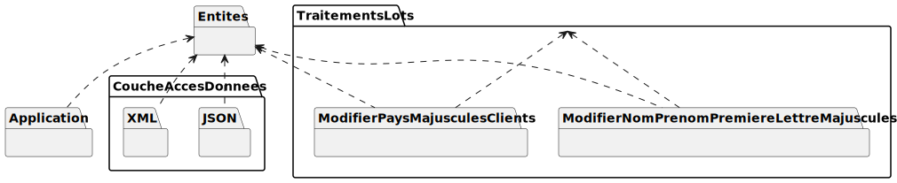

# Module 06 - Formats d'échanges

## Exercice 1 - Clients

Un client est défini par :

- Un identifiant de type Guid
- Un prénom et un nom
- Une liste d'adresses

Une adresse est définie par :

- Un numéro civique
- Une information complémentaire (app, etc.) de type chaîne
- Un odonyme
- Un type de voie
- Code postal
- Nom municipalité
- État
- Pays

1. Implantez les classes nécessaires à représentation d'un client.
2. Écrivez une interface de type dépot qui permet d'ajouter un client, effectuer la recherche d'un client par son identifiant et lister tous les clients.
3. Écrivez deux classes qui implante l'interface précédente et qui implantent  respectivement un dépot de type XML (le format est libre) et un dépôt JSON.
4. Créez une application console qui permet de manipuler un dépôt à l'aide d'un menu. L'application console doit être codée dans la classe "ClientUIConsole". Elle reçoit le dépôt au moment de son initialisation.
Afin de simplifier l'écriture du code, la saisie de l'adresse peut-être simulée par une méthode qui renvoie des adresses aléatoires.
5. Utilisez le cadriciel d'injection de dépendances "Unity" afin d'injecter le dépot au moment de l'instanciation d'un objet de la classe "ClientUIConsole".
6. Dans l'interface de dépot clients, ajoutez une méthode qui permet de modifier un client.
7. Créez une interface "TraitementLot" qui contient seulement la méthode "Executer" qui ne prend pas de paramètre et ne renvoie rien
8. Créez une autre classe "ModifierNomPrenomPremiereLettreMajusculesTraitementLot" qui implante l'interface précédente. Le traitement parcours la liste de clients et doit modifier leur nom et/ou prénom s'ils l'un d'eux ou les deux ne débutent pas par une majuscule. Dans le cas contraire, ils ne doivent pas être enregistrés.
9. Créez une classe "ModifierPaysMajusculesClientsTraitementLot" qui implante l'interface précédente. Le traitement parcours la liste des clients et convertir l'ensemble des pays des adresses en majuscules si ce n'est pas déjà le cas. Dans le cas contraire, ils ne doivent pas être enregistrés.
10. Testez les deux précédents traitements. Utilisez des Moq afin de valider que les méthodes de sauvegarde ne sont pas appelées pour rien.

    
Proposition de diagramme de classes

    
Proposition de diagramme de classes

