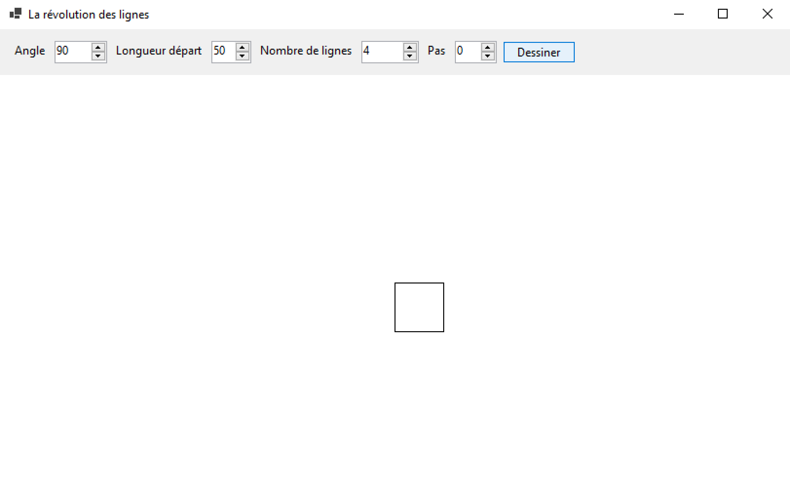
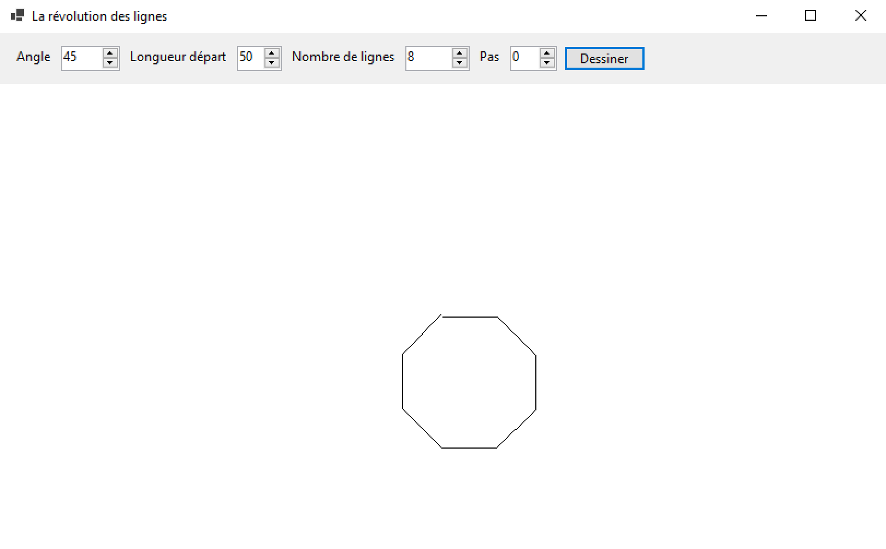
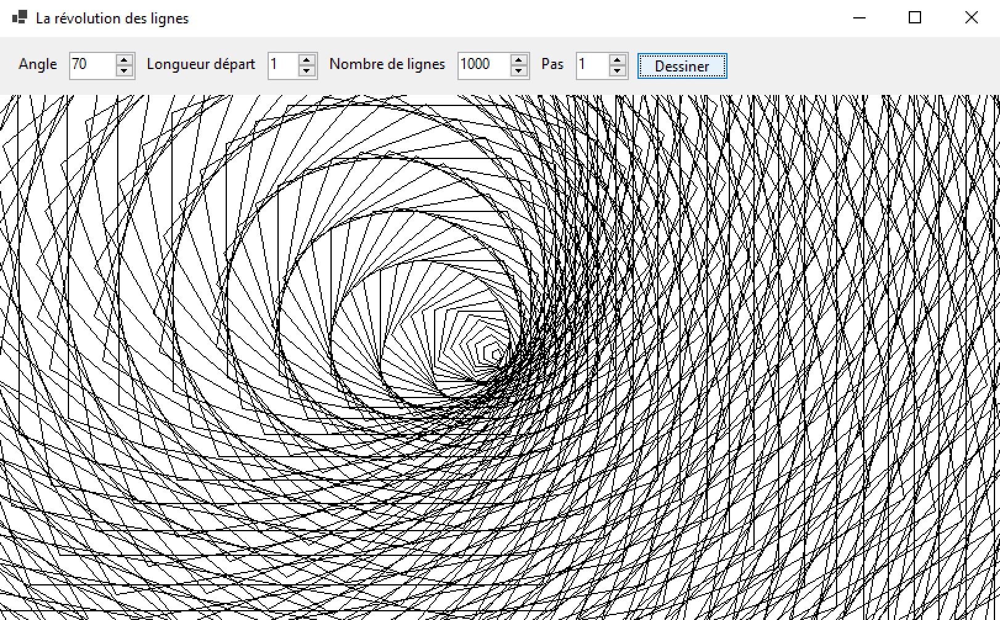

# Module 11 - Dessin

## Exercice 1 - La révolution des lignes

Le but de cet exercice est de créer une application qui, à partir d'une configuration de départ, efface la surface de dessin et trace un ensemble de lignes contiguës. Le premier point est le centre. Les autres points sont calculés à partir de la configuration de départ : angle et longueur à ajouter à chaque nouvelle ligne.

Voici quelques exemples de dessins que vous serez capable de faire à la fin avec votre application :

### Exercice 1.1 - Mise en place de l'interface

Voici la fenêtre à créer dans cette partie de l'exercice :

Étapes :

- Créez la solution et le projet "POOII_Module11_Revolution_Lignes"
- Renommez le formulaire principale pour "fRevolutionLignes" et modifiez le titre de la fenêtre pour "La révolution des lignes"
- Configurez la taille minimale de la fenêtre pour 600 pixels de largeur et 512 pixels de hauteur
- Ajoutez-y le contrôle de type "panel" nommé "pControles", configurez la propriété "Dock" pour qu'elle prenne la valeur "Top"
- Dans ce panel, en vous basant sur l'image de l'interface, ajoutez les contrôles de type "Label", "Button" et "NumericUpDown" :
  - nudAngle : angle avec des valeurs comprises entre 0 et 360, un pas de 1, valeur initiale de 90 et pas de décimale
  - nudLongueurDepart : longueur de départ avec des valeurs comprises entre 1 et 200, un pas de 1, valeur initiale de 50 et pas de décimale
  - nudNombreLignes : nombre de lignes à dessiner comprise entre 1 et 1000, avec un pas de 1, valeur initiale de 4 et pas de décimale
  - nudPas : valeur à ajouter à la longueur après le dessin d'une ligne comprise entre -10 et 10, avec un pas de 1, valeur initiale de 0 et pas de décimale
- À partir du formulaire, ajoutez un nouveau "panel" nommé "pCanvas", configurez les propriétés "Dock" et "BackColor" pour qu'elles prennent respectivement les valeurs "Fill" et "White"

### Exercice 1.2 - Récupération des valeurs

- Écrivez la classe "ConfigurationRevolution" qui contient les propriétés suivantes : angle, longueur de départ, nombre de lignes, pas, position de départ (valeurs x et y)
- Dans de la classe "fRevolutionLignes", écrivez la méthode "EtablirConfiguration" qui, à partir des données des contrôles, génère un objet de type "ConfigurationRevolution". Le point de départ est au centre du contrôle "pCanvas"
- Créez la classe "DessinRevolution" et écrivez la méthode statique "GenererPoints" qui, à partir de la configuration de la révolution renvoie la liste de la succession des points des lignes (n+1 points, n étant le nombre de lignes) en respectant les contraintes suivantes :
  - Le premier point est le point de départ
  - L'angle de départ est de 0 degré
  - Le second point de la ligne est calculé par rapport au point actuel ainsi qu'à l'angle et à la longueur :
    - nouveauX = ancienX + cos(angle) * longueur
    - nouveauY = ancienY + sin(angle) * longueur
  - Pour chaque nouvelle ligne, le dernier point calculé devient le nouveau, l'angle et la longueur sont respectivement incrémenté de l'angle demandé, et du pas

Pour votre information, l'axe y est ici inversé par rapport aux coordonnées cartésiennes.

### Exercice 1.3 - Maintenant on dessine !

- Créez la méthode "Dessiner" qui prend en paramètres : les options du dessin, un objet de type "Graphics" et un objet de type "Pen". Cette méthode doit dessiner l'ensemble des droites à l'aide des méthodes précédemment décrites. Pour ce faire, vous allez utiliser la méthode "DrawLines" de l'objet "Graphics". Vous aurez besoin de passer l'objet "Pen" et le tableau de points en paramètres.
- Ajoutez une méthode qui réagit à l'événement "click" du bouton pour déclencher le dessin :
  - Allez chercher l'objet de type "Graphics" avec la méthode "CreateGraphic" de la zone de dessin
  - Créez un objet de type "Pen" avec la couleur noire
