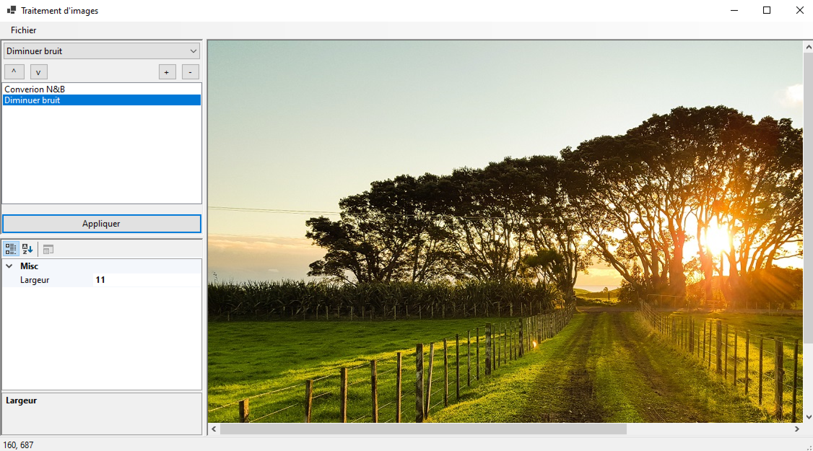
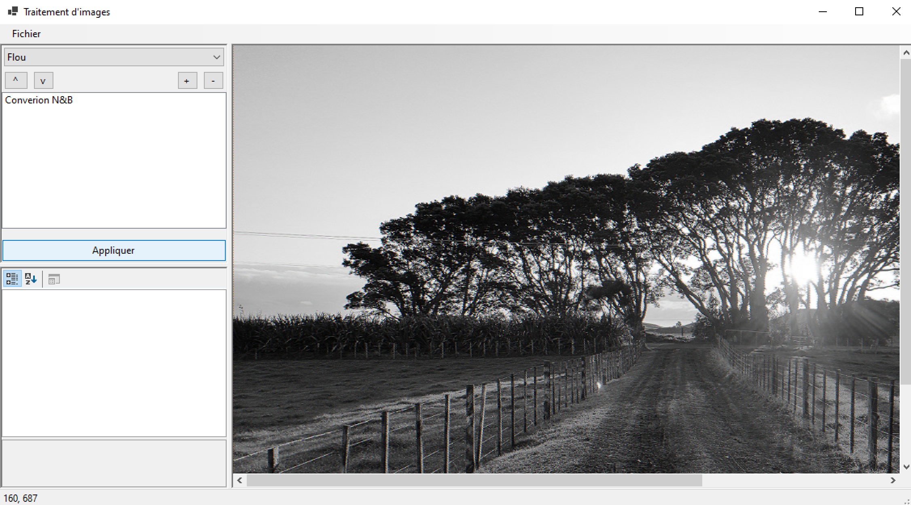
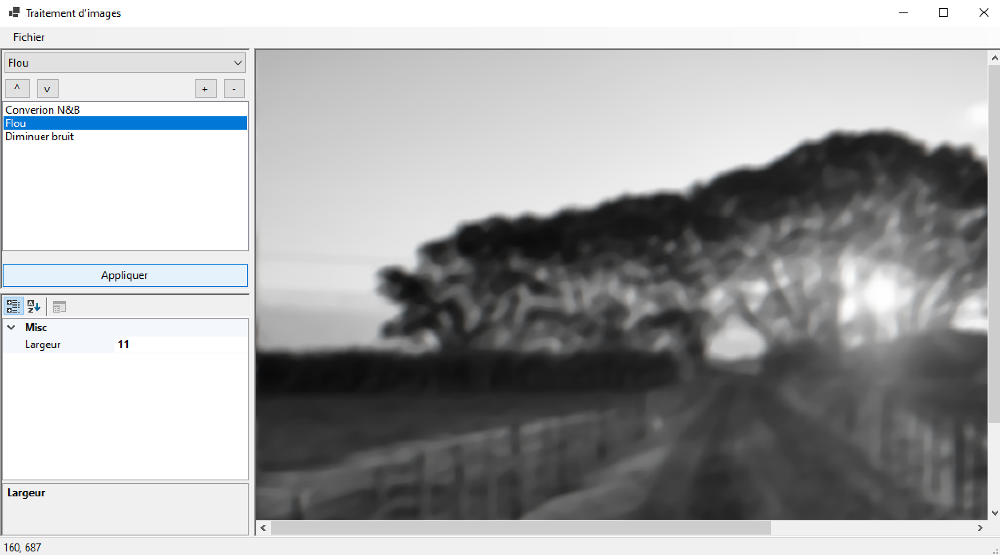
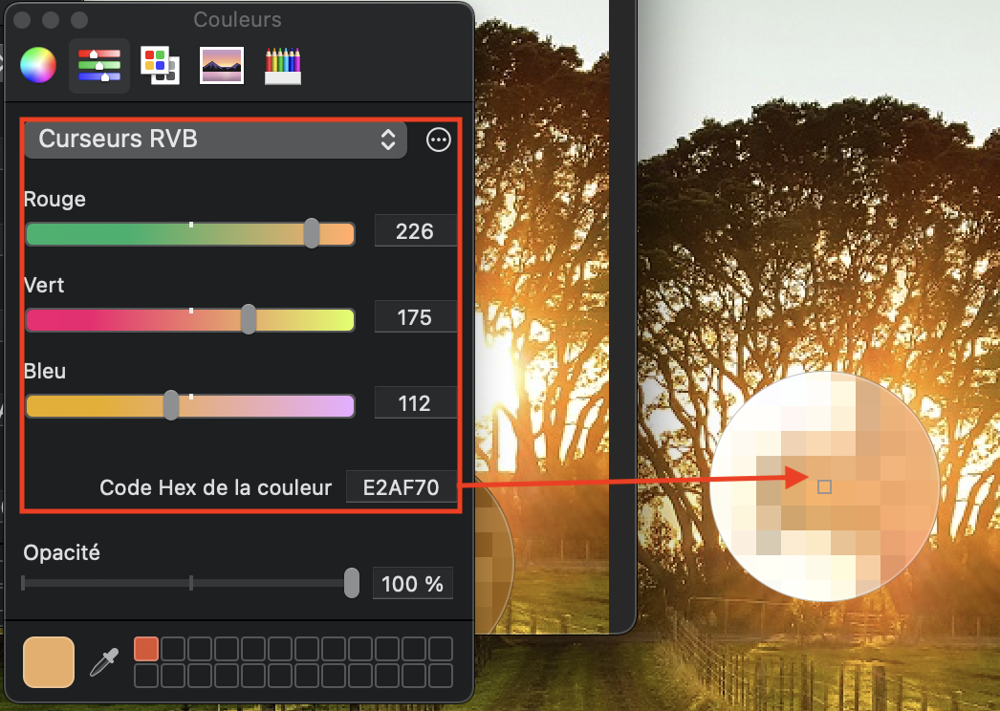
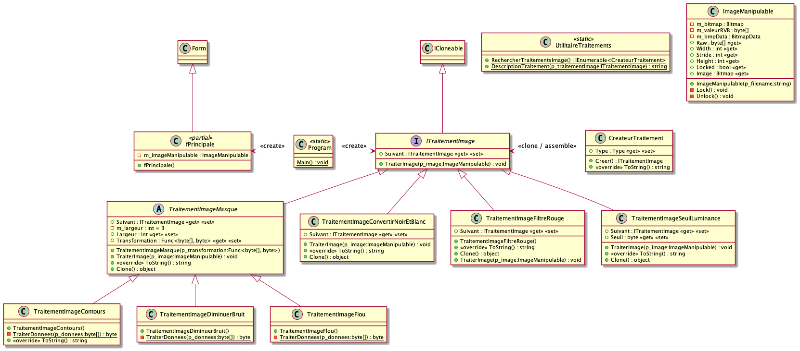
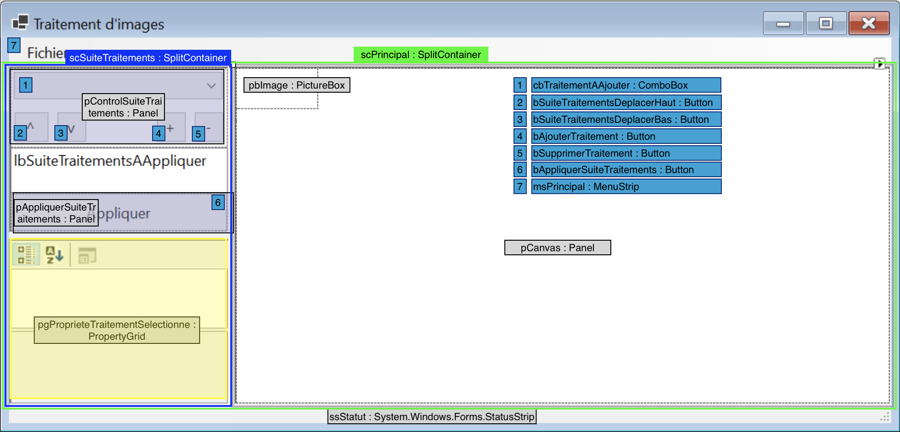

# Module 12 - Patrons de conception 03

## Exercice 1 - Traitement d'images

Votre application va permettre d'enchainer une suite de traitement graphique sur une image.

Par exemple, à partir de la première image et après application des traitements, vous pourrez obtenir les images qui suivent (l'image originale est disponible dans le dépôt) :







Une image peut être vue comme un tableau à deux dimensions où chaque case correspond à une mesure "d'une couleur".

Généralement, une image va être représentée par un tableau 1D de bytes (```byte[]```) qui stocke généralement trois composantes (i.e. un couple de trois valeurs) d'une couleur. On utilise classiquement l'espace de couleur RVB (Rouge / Vert / Bleu) avec 8 bits par couleur. Dans ce cas, on a l'intensité de chaque composante pour un pixel (**Pic**ture **El**ement).



Une image est donc une suite de pixels qui eux-même sont représentés par un triplet qui contiennent l'intensité des trois couleurs additives (R / V / B). On pourrait donc penser qu'une image 30 de largeur par 30 de hauteur nécessitera 30 * 30 * 3 = 2 700 octects. En fait, pour des raisons d'optimisation, on va chercher à aligner nos données en mémoire. Il se peut qu'on utilise plus d'octets utilisés que ce qui est nécessaire dans l'absolu. Ainsi, la bibliothèque que nous utilisons cherche à représenter chaque ligne d'une image avec un sous-tableau d'une longueur multiple de 4. Pour avoir la longueur d'une ligne, il faudra utiliser la propriété [```Stride```](https://learn.microsoft.com/en-us/dotnet/api/system.drawing.imaging.bitmapdata.stride). De plus, toujours avec notre bibliothèque, les composantes sont représentées en ordre inverse.

Par exemple si on a une image de 3 par 3 pixels, avec la première ligne rouge, la seconde verte et la troisième bleue, elle sera représentée par le tableau de bytes suivant (où P est une valeur de remplissage) : 

```
[
  0,   0, 255     ,   0,   0, 255    ,   0 ,  0, 255,       P, P, P,
  0, 255,   0     ,   0, 255,   0    ,   0, 255,   0,       P, P, P,
255,   0,   0     , 255,   0,   0    , 255,   0,   0,       P, P, P
]
```

<details>
    <summary>Proposition de diagramme de classes (Voir après réflexion personnelle !)</summary>



</details>

### Exercice 1.1 - Création de l'interface

- Créez la solution et le projet "POOII_Module12_TraitementImages"
- Reproduisez l'interface suivante en lisant ce qui suit avant de débuter :

- Liste des contrôles :
  - ssStatut : StatusStrip (Optionnel)
  - sslPositionSouris : ToolStripStatusLabel (Optionnel)
  - pCanvas : Panel
    - BackColor : White
    - AutoScroll : true
    - Dock : Fill
  - msPrincipal : MenuStrip
  - tsmiFichier : ToolStripMenuItem
  - tsmiOuvrir : ToolStripMenuItem
  - pbImage : PictureBox
    - SizeMode : AutoSize
  - scPrincipal : SplitContainer
    - BorderStyle : Fixed3D
  - scSuiteTraitements : SplitContainer
    - BorderStyle : Fixed3D
  - pgProprieteTraitementSelectionne : PropertyGrid
  - pControlSuiteTraitements : Panel
  - pAppliquerSuiteTraitements : Panel
  - bAjouterTraitement : Button
  - bSupprimerTraitement : Button
  - cbTraitementAAjouter : ComboBox
    - DropDownStyle : DropDownList
  - bAppliquerSuiteTraitements : Button
  - bSuiteTraitementsDeplacerBas : Button
  - bSuiteTraitementsDeplacerHaut : Button
  - lbSuiteTraitementsAAppliquer : ListBox 
- Ajoutez le menu "Fichier" ainsi que le sous-menu "Ouvrir"
- Mise à part les contrôles du panel "pControlSuiteTraitements", tous les contrôles utilisent un positionnement de type "Dock" soit avec l'option Bottom, Top ou Fill. Attention, le contrôle qui utilise le type Fill doit être placé en dernier dans le conteneur qui le contient.

### Exercice 1.2 - Chaîne de responsabilité

- Créez la classe "ImageManipulable" avec le code suivant :

```csharp
// Référence https://docs.microsoft.com/en-us/dotnet/api/system.drawing.bitmap.lockbits?view=dotnet-plat-ext-3.1
public class ImageManipulable
{
    private Bitmap m_bitmap;
    private byte[] m_valeurRVB;
    private BitmapData m_bmpData;

    public byte[] Raw
    {
        get
        {
            this.Lock();
            return this.m_valeurRVB;
        }
    }

    public int Width => this.m_bitmap.Width;
    public int Stride => this.m_bmpData.Stride; // ! les lignes sont alignées sur 4 octets
    public int Height => this.m_bitmap.Height;

    public ImageManipulable(string p_filename)
    {
        // Create a new bitmap.
        this.m_bitmap = new Bitmap(p_filename);
    }

    private void Lock()
    {
        if (!this.Locked)
        {
            // Lock the bitmap's bits.  
            Rectangle rect = new Rectangle(0, 0, this.m_bitmap.Width, this.m_bitmap.Height);
            this.m_bmpData =
                this.m_bitmap.LockBits(rect, System.Drawing.Imaging.ImageLockMode.ReadWrite,
                PixelFormat.Format24bppRgb);
            //this.m_bitmap.PixelFormat);

            // Declare an array to hold the bytes of the bitmap.
            int bytes = Math.Abs(this.m_bmpData.Stride) * this.m_bitmap.Height;
            this.m_valeurRVB = new byte[bytes];

            // Copy the RGB values into the array.
            System.Runtime.InteropServices.Marshal.Copy(this.m_bmpData.Scan0, this.m_valeurRVB, 0, bytes);
        }
    }

    public bool Locked => this.m_bmpData != null;

    private void Unlock()
    {
        if (this.Locked)
        {
            int bytes = Math.Abs(this.m_bmpData.Stride) * this.m_bitmap.Height;

            // Copy the RGB values back to the bitmap
            System.Runtime.InteropServices.Marshal.Copy(this.m_valeurRVB, 0, this.m_bmpData.Scan0, bytes);

            // Unlock the bits.
            this.m_bitmap.UnlockBits(this.m_bmpData);
            this.m_bmpData = null;
        }
    }

    public Color this[int x, int y]
    {
        get
        {
            Color res;
            if (this.Locked)
            {
                int pixel = (y * this.m_bitmap.Width + x) * 3;
                res = Color.FromArgb(this.m_valeurRVB[pixel], this.m_valeurRVB[pixel + 1], this.m_valeurRVB[pixel + 2]);
            }
            else
            {
                res = this.m_bitmap.GetPixel(x, y);
            }

            return res;
        }
        set
        {
            this.Lock();
            int pixel = (y * this.m_bitmap.Width + x) * 3;
            this.m_valeurRVB[pixel] = value.R;
            this.m_valeurRVB[pixel + 1] = value.G;
            this.m_valeurRVB[pixel + 2] = value.B;

        }
    }

    public Bitmap Image
    {
        get
        {
            this.Unlock();

            return this.m_bitmap;
        }
    }
}
```

- Créez la classe "CreateurTraitement" :

```csharp
public class CreateurTraitement
{
    public Type Type { get; set; }
    public ITraitementImage Creer()
    {
        return (ITraitementImage)Activator.CreateInstance(this.Type);
    }

    public override string ToString()
    {
        string res = this.Type.Name;
        DescriptionAttribute da = this.Type.GetCustomAttribute<DescriptionAttribute>();

        if (da != null)
        {
            res = da.Description;
        }

        return res;
    }
}
```

- Créez la classe "UtilitaireTraitements" :

```csharp
public static class UtilitaireTraitements
{
    public static IEnumerable<CreateurTraitement> RechercherTraitementsImage()
    {
        Type typeITraitementImage = typeof(ITraitementImage);

        List<Type> traitements = AppDomain.CurrentDomain.GetAssemblies()
            .SelectMany(e => e.GetTypes())
            .Where(t => typeITraitementImage.IsAssignableFrom(t)
            && t.GetCustomAttribute<DescriptionAttribute>() != null)
            .ToList();


        return traitements.Select(t => new CreateurTraitement() { Type = t });
    }

    public static string DescriptionTraitement(ITraitementImage p_traitementImage)
    {
        string res = p_traitementImage.GetType().Name;
        DescriptionAttribute da = p_traitementImage.GetType().GetCustomAttribute<DescriptionAttribute>();

        if (da != null)
        {
            res = da.Description;
        }

        return res;
    }
}
```

- Créez l'interface "ITraitementImage" qui suit le patron "chaîne de responsabilité". Cette interface doit implanter l'interface "ICloneable" (Pour implanter la méthode, renvoyez simplement le résultat de la méthode ["MemberwiseClone"](https://docs.microsoft.com/en-us/dotnet/api/system.object.memberwiseclone?view=net-6.0)). La méthode de traitement doit se nommer "TraiterImage". Cette méthode prend un "ImageManipulable" en paramètres et ne renvoie rien
- Créez la classe "TraitementImageConvertirNoirEtBlanc". Cette classe convertit l'ensemble des pixels de l'image en noir et blanc.
- Ajoutez le code suivant dans la méthode de traitement ainsi que le code nécessaire à l'appel de la suite de la chaîne :

```csharp
byte[] raw = p_image.Raw;
for (int longueur = 0; longueur < raw.Length / 3; longueur++)
{
    int l3 = longueur * 3;
    byte luminance = (byte)((raw[l3] + raw[l3 + 1] + raw[l3 + 2]) / 3);
    raw[l3] = luminance;
    raw[l3 + 1] = luminance;
    raw[l3 + 2] = luminance;
}
```

- Créez la classe abstraite "TraitementImageMasque" qui implante l'interface "ITraitementImage". Cette classe permet d'appliquer un masque sur une image.
- Ajoutez-y les propriétés suivantes :
  - Largeur : la largeur doit-être impaire et ne doit pas être inférieure à 1
  - Transformation : fonction qui prend un tableau de "byte" et renvoie un "byte" (Voir classe Func). Le tableau correspond à l'ensemble des pixels voisins du pixel qui est traité. La valeur renvoyée est la nouvelle valeur du pixel traité.
- Ajoutez le code suivant dans la méthode de traitement ainsi que le code nécessaire à l'appel de la suite de la chaîne :

```csharp
byte[] raw = p_image.Raw;
byte[] res = new byte[raw.Length];
int width = p_image.Width;
int height = p_image.Height;
int stride = p_image.Stride;
byte[] donneesCourantes = new byte[this.Largeur * this.Largeur];
for (int colonne = 0; colonne < width; colonne++)
{
    for (int ligne = 0; ligne < height; ligne++)
    {
        for (int composante = 0; composante < 3; composante++)
        {
            int posDonneesCourantes = 0;
            for (int masqueX = -this.Largeur / 2; masqueX <= this.Largeur / 2; masqueX++)
            {
                int posX = Math.Min(Math.Max(0, colonne + masqueX), width - 1);
                for (int masqueY = -this.Largeur / 2; masqueY <= this.Largeur / 2; masqueY++)
                {
                    int posY = Math.Min(Math.Max(0, ligne + masqueY), height - 1);
                    donneesCourantes[posDonneesCourantes] = raw[posY * stride + posX * 3 + composante];
                    ++posDonneesCourantes;
                }
            }
            res[ligne * stride + colonne * 3 + composante] = this.Transformation(donneesCourantes);
        }
    }
}

Array.Copy(res, raw, raw.Length);
```

- Créez la classe "TraitementImageContours" qui effectue un filtre passe-haut qui correspond à un des algorithmes de détection de contours. Cette classe hérite de "TraitementImageMasque". Copiez-y la méthode suivante :

```csharp
private static byte TraiterDonnees(byte[] p_donnees)
{
    int coeficientCentrale = p_donnees.Length - 1;
    int posCentrale = p_donnees.Length / 2;
    int somme = 0;
    for (int i = 0; i < posCentrale; i++)
    {
        somme -= p_donnees[i];
    }
    somme += coeficientCentrale * p_donnees[posCentrale];
    for (int i = posCentrale + 1; i < p_donnees.Length; i++)
    {
        somme -= p_donnees[i];
    }
    return (byte)(somme / p_donnees.Length);
}
```

- Créez la classe "TraitementImageDiminuerBruit" qui effectue un filtre qui prend la valeur médiane des valeurs extraites par le masque. Cette classe hérite de "TraitementImageMasque". Copiez-y la méthode suivante :

```csharp
private static byte TraiterDonnees(byte[] p_donnees)
{
    Array.Sort(p_donnees);

    return p_donnees[p_donnees.Length / 2];
}
```

- Créez la classe "TraitementImageFlou" qui effectue un filtre flou en moyennant les valeurs extraites par le masque. Cette classe hérite de "TraitementImageMasque". Copiez-y la méthode suivante :

```csharp
private static byte TraiterDonnees(byte[] p_donnees)
{
    int somme = 0;
    for (int i = 0; i < p_donnees.Length; i++)
    {
        somme += p_donnees[i];
    }

    return (byte)(somme / p_donnees.Length);
}
```

- Créez la classe "TraitementImageSeuilLuminance" qui effectue un seuil par rapport à la valeur de la luminance du pixel traité. Cette classe implante l'interface "ITraitementImage". Cette classe doit avoir une propriété Seuil de type entier. Pour le reste, copiez-y la méthode suivante :

```csharp
public void TraiterImage(ImageManipulable p_image)
{
    byte[] raw = p_image.Raw;
    for (int longueur = 0; longueur < raw.Length / 3; longueur++)
    {
        int l3 = longueur * 3;
        byte luminance = (byte)((raw[l3] + raw[l3 + 1] + raw[l3 + 2]) / 3);
        byte valeur = 0;
        if (luminance > this.Seuil)
        {
            valeur = 255;
        }
        raw[l3] = valeur;
        raw[l3 + 1] = valeur;
        raw[l3 + 2] = valeur;
    }

    this.Suivant?.TraiterImage(p_image);
}
```

- Pour chacun des traitements :
  - Ajoutez l'attribut "Description" avec une courte description. Exemple :
    ```csharp
        [Description("Filtre sépia")]
        public class TraitementImageFiltreSepia : ITraitementImage
        {
        ...
    ```
  - Écrivez les méthodes "ToString" qui, à partir de la classe utilitaire, renvoie la description du traitement.

### Exercice 1.3 - Animation de l'interface !

- Ajoutez une méthode pour l'événement "load" de la fenêtre : vous devez charger les données du contrôle "cbTraitementAAjouter" à partir de la méthode "RechercherTraitementsImage".
- Ajoutez une méthode pour l'événement "click" du menu "Ouvrir" : vous devez afficher une boite de sélection de fichiers "JPEG". Si l'utilisateur choisit d'ouvrir le fichier, vous devez utiliser la classe "ImageManipulable" pour effectuer cette action.
- À partir de l'objet créé, Allez mettre à jour la propriété "Image" du contrôle "pbImage".
- Les boutons "^" et "v" permettent de déplacer le traitement de la suite de traitements vers le haut ou le bas.
- Le bouton "-" permet de supprimer le traitement sélectionné de la suite de traitements.
- Le bouton "+" permet d'ajouter le traitement sélectionné dans le combobox et de l'ajout à fin de la suite de traitements. Pour cela, castez le traitement sélectionné dans le type "CreateurTraitement" et appelez la méthode "Creer".
- Ajoutez une méthode sur l'événement "SelectedIndexChanged" du contrôle "lbSuiteTraitementsAAppliquer" et mettez à jour la propriété "SelectedObject" du PropertyGrid avec l'objet sélectionné.
- Testez que vous pouvez bien ajouter des traitements, les déplacer et afficher les propriétés des traitements.
- Qu'observez-vous ?
- Sur chaque propriété qui ne devrait pas se retrouver dans le contrôle "pgProprieteTraitementSelectionne", ajoutez l'attribut "Browsable" avec la valeur false passée en paramètres
- Ajoutez une méthode pour l'événement "click" du bouton "Appliquer". Cette méthode doit créer la chaîne de traitements à partir du contrôle "lbSuiteTraitementsAAppliquer" et lancez le traitement sur l'image courante.

### Exercice 1.4 - Ajouter des traitements (Optionnel - amusement)

Les traitements se basent sur un tableau de byte. Chaque pixel prend ici 3 bytes : la valeur rouge, la valeur verte, la valeur bleue. Chaque composante de couleur a donc un intervalle de valeur compris entre 0 et 255. La dimension du tableau est donc de 3 * largeur * hauteur de l'image.

- À partir de cette information, relisez le traitement qui transforme l'image en noir et blanc afin de valider que vous comprenez bien la structure.
- Écrivez de nouveaux traitements :
  - TraitementImageRouge : ne garde que la composante rouge
  - TraitementImageVert : ne garde que la composante verte
  - TraitementImageBleu : ne garde que la composante bleu
- Rajoutez une méthode dans le menu qui permet de sauvegarder du "PictureBox" dans un fichier "JPEG" choisi par l'utilisateur

### Exercice 1.5 - Sauvegarde de la suite des traitements (Optionnel - révision JSON / XML)

- Proposez une façon de sauvegarder et de charger la configuration de la suite de traitements. Vous devez utiliser soit un format XML ou un format JSON.
