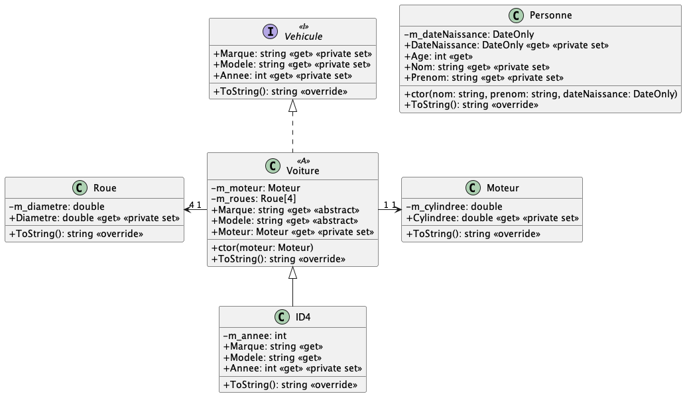

# Révisions

Ce document est une révision des concepts de base de la programmation orientée objet en C#. Il est destiné à servir de référence rapide pour les étudiants. Il contient les définitions des concepts clés, des exemples de code et des bonnes pratiques. Il doit être complété au fur et à mesure de l'avancement du cours par les étudiants.

Dans ce cours, nous utilisons le langage C#. Les termes `attribut`, `propriété` ayant des significations différentes en C#, nous utiliserons le terme `donnée membre`/`variable membre`/`variable d'état` pour désigner une variable d'instance d'une classe. Les attributs en C# sont des métadonnées qui peuvent être appliquées à des classes, des méthodes, des propriétés, etc., pour fournir des informations supplémentaires sur le code. Ils sont utilisés pour la réflexion et la sérialisation, entre autres. Les propriétés en C# sont des membres de classe qui encapsulent l'accès aux données membres ou l'accès à de cours algorithmes. Ils permettant ainsi de définir des accesseurs (getters) et des mutateurs (setters).

Le terme `ctor` est utilisé afin de raccourcir le nom du constructeur.

Le nom des données membres commence par un `m_` afin de les différencier des variables locales. Les propriétés, les méthodes et les classes commencent par une majuscule. Les noms des méthodes sont en PascalCase, tandis que les noms des variables locales et des paramètres sont en camelCase.

Le nom du projet de tests unitaires doit être le même que le nom du projet testé, suivi du suffixe `.Tests`. Par exemple, si le projet à tester s'appelle `MonProjet`, le projet de test doit s'appeler `MonProjet.Tests`.

Les noms des fichiers de tests unitaires doivent correspondre au nom de la classe testée, suivis du suffixe `Tests`. Par exemple, si la classe à tester s'appelle `MaClasse`, le fichier de test doit s'appeler `MaClasseTests.cs`.

Le nom des méthodes de test doivent comprendre trois parties :

- Le nom de la méthode testée, en PascalCase.
- La description du test, en PascalCase.
- Le résultat attendu, en PascalCase.

Par exemple, si la méthode à tester s'appelle `Additionner`, le nom de la méthode de test doit être `Additionner_DonnerDeuxNombres_RetourneLaSomme`.

Les tests unitaires sont écrits en utilisant le framework de test xUnit. Les tests doivent être organisés en classes de test, chacune contenant des méthodes de test. Chaque méthode de test doit être annotée avec l'attribut `[Fact]` pour indiquer qu'il s'agit d'un test unitaire.

Les questions notées avec un astérisque (*) sont des questions de révision de POOI. Les questions notées avec deux astérisques (**) sont des questions de révision de POOII. Les questions notées "Autres" sont des questions d'ordre général.

## 1. Qu'est-ce qu'une classe ? *

Une classe est un modèle pour créer des objets. Elle définit un ensemble des données membres (ou variables d'instance) et de méthodes qui caractérisent tout objet de cette classe. En d'autres termes, une classe est une abstraction qui permet de regrouper des données et des comportements associés.

Les données membres représentent l'état de l'objet, tandis que les méthodes définissent les comportements que l'objet peut effectuer. En C#, une classe est définie à l'aide du mot-clé `class`, suivi du nom de la classe et d'un bloc de code qui contient les données membres et les méthodes.

Lors de l'exécution d'une méthode, il faut considérer que l'objet est dans un état cohérent. Cela signifie que toutes les données membres de l'objet doivent être valides et conformes aux règles définies par la classe. Par exemple, si une classe représente un compte bancaire, l'état cohérent de l'objet doit garantir que le solde du compte est toujours supérieur ou égal à zéro. Si une méthode modifie l'état de l'objet, elle doit s'assurer que l'objet reste dans un état cohérent après la modification.

La cohérence de l'état d'un objet est importante pour garantir le bon fonctionnement du programme et éviter les erreurs. Les méthodes de la classe doivent être conçues pour maintenir cette cohérence en effectuant des validations et des contrôles appropriés avant de modifier l'état de l'objet. Cela peut inclure des vérifications de type, des validations de données et des exceptions pour gérer les erreurs.

## 2. Qu'est-ce qu'un objet ? *

Un objet est une instance d'une classe. Il représente une entité concrète qui possède des données (état) et des comportements (méthodes) définis par la classe. Chaque objet peut avoir des valeurs différentes pour ses données, mais il partage la même structure et les mêmes comportements que les autres objets de la même classe.

## 3. Qu'est-ce qu'une méthode ? *

Une méthode est une fonction définie à l'intérieur d'une classe. Elle décrit un comportement que les objets de cette classe peuvent effectuer. Les méthodes peuvent accéder et modifier les données membres de l'objet, et elles peuvent également prendre des arguments pour effectuer des opérations spécifiques. Les méthodes sont appelées sur des objets et peuvent être utilisées pour interagir avec les données de l'objet ou pour effectuer des calculs.

## 4. Qu'est-ce qu'une précondition ? *

Une précondition est une condition qui doit être vraie avant l'exécution d'une méthode ou d'une fonction. Elle définit les exigences que les arguments ou l'état de l'objet doivent respecter pour que la méthode fonctionne correctement. Si une précondition n'est pas satisfaite, la méthode peut ne pas produire le résultat attendu ou peut même provoquer une erreur. Les préconditions sont généralement documentées dans la documentation de la méthode.

```csharp
public class CompteBancaire
{
    private decimal m_solde;

    public void Retirer(decimal montant)
    {
        if (montant <= 0 || montant > m_solde)
        {
            throw new ArgumentException(nameof(montant), "Le montant doit être positif et inférieur ou égal au solde.");
        }

        m_solde -= montant;
    }
}
```

## 5. Documentation des classes et des méthodes * / **

La documentation des classes et des méthodes est essentielle pour faciliter la compréhension et l'utilisation du code. En C#, la documentation XML peut être utilisée pour générer automatiquement de la documentation à partir des commentaires dans le code source. Voici quelques bonnes pratiques pour documenter les classes et les méthodes :

```csharp
/// <summary>
/// Représente un compte bancaire d'épargne.
 /// </summary>
/// <remarks>
/// Cette classe permet de gérer les opérations bancaires.
/// </remarks>
/// <example>
/// Voici un exemple d'utilisation :
/// <code>
/// CompteEpargne compte = new CompteEpargne();
/// compte.Deposer(100);
/// compte.Retirer(50);
/// </code>
/// </example>
/// <seealso cref="CompteCourant"/>
public class CompteEpargne
{
    /// <summary>
    /// Le solde du compte.
    /// </summary>
    private decimal m_solde;

    /// <summary>
    /// Dépose un montant sur le compte.
    /// </summary>
    /// <param name="montant">Le montant à déposer. Le montant doit être positif.</param>
    public void Deposer(decimal montant)
    {
        if (montant <= 0)
        {
            throw new ArgumentException(nameof(montant), "Le montant doit être positif.");
        }

        m_solde += montant;
    }

    /// <summary>
    /// Retire un montant du compte.
    /// </summary>
    /// <param name="montant">Le montant à retirer. Le montant doit être positif et inférieur ou égal au solde.</param>
    public void Retirer(decimal montant)
    {
        if (montant <= 0 || montant > m_solde)
        {
            throw new ArgumentException(nameof(montant), "Le montant doit être positif et inférieur ou égal au solde.");
        }

        m_solde -= montant;
    }
}
```

## 5 Bis. Est-ce que je dois écrire des commentaires dans mon code ? *

Non, il faut éviter d'écrire des commentaires dans le code. Les commentaires peuvent rendre le code plus difficile à lire et à comprendre, car ils peuvent être obsolètes ou trompeurs. Il est préférable d'utiliser des noms de variables, de méthodes et de classes explicites pour rendre le code auto-documenté. Si vous devez ajouter des commentaires, assurez-vous qu'ils sont clairs, concis et pertinents.

Un code est comme une blague : si vous devez l'expliquer, c'est qu'il n'est pas bon.

## 6. Qu'est-ce qu'une donnée membre ? *

Une donnée membre (ou variable d'instance) est une variable qui est définie à l'intérieur d'une classe et qui est associée à chaque instance de cette classe. Les données membres représentent l'état de l'objet et peuvent être utilisées pour stocker des informations spécifiques à chaque instance. Les méthodes de la classe peuvent accéder et modifier ces données membres pour refléter le comportement de l'objet. Les données membres ne doivent pas être confondues avec les variables locales, qui sont définies à l'intérieur d'une méthode et ne sont accessibles qu'à l'intérieur de cette méthode.

## 7. Qu'est-ce qu'un constructeur ? *

Un constructeur est une méthode spéciale d'une classe qui est appelée automatiquement lors de la création d'un nouvel objet de cette classe. Il est utilisé pour initialiser les données membres de l'objet et pour effectuer toute autre configuration nécessaire. Le constructeur a généralement le même nom que la classe et n'a pas de type de retour. En C#, le constructeur peut être surchargé, ce qui signifie que vous pouvez définir plusieurs constructeurs avec des signatures différentes pour permettre différentes façons d'initialiser un objet. Les constructeurs peuvent également prendre des paramètres pour permettre une initialisation personnalisée des données membres de l'objet.

## 8. À quoi servent les modificateurs d'accès ? *

Les modificateurs d'accès sont des mots-clés utilisés pour contrôler la visibilité et l'accessibilité des membres d'une classe (données membres et méthodes) depuis l'extérieur de la classe. Ils permettent de définir qui peut accéder à ces membres et de protéger l'état interne de l'objet. En C#, les principaux modificateurs d'accès sont :

- **public** : Le membre est accessible depuis n'importe où dans le code, y compris depuis d'autres classes et espaces de noms.
- **private** : Le membre est accessible uniquement à l'intérieur de la classe dans laquelle il est défini. Il n'est pas accessible depuis d'autres classes ou espaces de noms.
- **protected** : Le membre est accessible à l'intérieur de la classe dans laquelle il est défini et dans les classes dérivées (sous-classes). Il n'est pas accessible depuis d'autres classes qui ne sont pas dérivées.
- **internal** : Le membre est accessible uniquement à l'intérieur de l'assembly (projet) dans lequel il est défini. Il n'est pas accessible depuis d'autres assemblies.

Il existe également d'autres modificateurs d'accès, tels que `protected internal`, qui combinent les comportements de `protected` et `internal`, et `private protected`, qui combine les comportements de `private` et `protected`.

## 9. Qu'est-ce que l'encapsulation ? *

L'encapsulation est un principe de la programmation orientée objet qui consiste à regrouper les données et les méthodes qui opèrent sur ces données au sein d'une même classe. Elle permet de protéger l'état interne d'un objet en restreignant l'accès direct aux données membres depuis l'extérieur de la classe. L'encapsulation est réalisée en utilisant des modificateurs d'accès (comme `private`, `public`, `protected`) pour contrôler la visibilité des données et des méthodes. Cela permet de cacher les détails d'implémentation et de fournir une interface claire pour interagir avec l'objet, ce qui facilite la maintenance et la compréhension du code.
L'encapsulation permet également de garantir que les données d'un objet ne peuvent être modifiées que par des méthodes spécifiques, ce qui aide à maintenir l'intégrité des données et à éviter les erreurs.
L'encapsulation est souvent considérée comme l'un des principes fondamentaux de la programmation orientée objet, aux côtés de l'héritage et du polymorphisme.

Il faut faire attention de ne pas briser l'encapsulation en créant des accesseurs publics pour les données membres privées. Cela peut exposer l'état interne de l'objet et rendre le code plus difficile à maintenir. Au lieu de cela, il est préférable d'utiliser des méthodes publiques pour interagir avec les données membres, ce qui permet de contrôler l'accès et de valider les modifications apportées à l'état de l'objet.

Il faut aussi faire attention à ne pas renvoyer des références vers des objets internes dans les accesseurs. Cela peut permettre à l'utilisateur de modifier directement l'état interne de l'objet, ce qui va à l'encontre du principe d'encapsulation. Au lieu de cela, il est préférable de renvoyer une copie de l'objet ou d'utiliser des méthodes pour interagir avec l'objet interne.

## 10. Pourquoi éviter de rendre les données membres publiques ? *

Rendre les données membres publiques expose l'état interne de l'objet et permet à d'autres classes ou parties du code de modifier directement ces données. Cela va à l'encontre du principe d'encapsulation, qui vise à protéger l'état interne d'un objet et à garantir que les données ne peuvent être modifiées que par des méthodes spécifiques. En rendant les données membres publiques, vous perdez le contrôle sur la manière dont elles sont utilisées et modifiées, ce qui peut entraîner des erreurs, des incohérences et des difficultés de maintenance.

## 11. Pourquoi éviter de rendre des données membres protected ? *

Rendre des données membres `protected` permet aux classes dérivées d'accéder directement à ces données, ce qui peut entraîner une dépendance étroite entre la classe de base et les classes dérivées. Cela peut rendre le code plus difficile à maintenir et à comprendre, car les classes dérivées peuvent modifier l'état interne de la classe de base sans passer par des méthodes spécifiques. De plus, cela peut rendre le code moins flexible, car les classes dérivées peuvent être contraintes de respecter l'implémentation de la classe de base.
Il est généralement préférable de rendre les données membres `private` et de fournir des méthodes d'accès (accesseurs) pour interagir avec ces données. Cela permet de contrôler l'accès aux données et de garantir que les modifications apportées à l'état interne de l'objet passent par des méthodes spécifiques, ce qui facilite la maintenance et la compréhension du code.

## 12. Qu'est-ce qu'un accesseur ? *

Un accesseur est une méthode qui permet d'accéder à une donnée membre d'une classe. En C#, les accesseurs sont généralement des propriétés (ou "properties") qui encapsulent l'accès aux données membres. Les propriétés permettent de définir des méthodes d'accès (getters) et de modification (setters) pour les données membres ou des algorithmes, tout en cachant la complexité de l'implémentation. Cela permet de contrôler l'accès aux données et d'appliquer des règles de validation si nécessaire.

Il est important de faire attention de ne pas briser l'encapsulation en créant des accesseurs publics pour les données membres privées. Cela peut exposer l'état interne de l'objet et rendre le code plus difficile à maintenir. Au lieu de cela, il est préférable d'utiliser des méthodes publiques pour interagir avec les données membres, ce qui permet de contrôler l'accès et de valider les modifications apportées à l'état de l'objet.

## 13. Qu'est-ce que l'héritage ? *

L'héritage est un concept de la programmation orientée objet qui permet de créer une nouvelle classe (appelée classe dérivée ou sous-classe) à partir d'une classe existante (appelée classe de base ou super-classe). La classe dérivée hérite des données membres et des méthodes de la classe de base, ce qui lui permet de réutiliser le code existant et d'étendre ou de modifier le comportement de la classe de base. L'héritage ne doit pas être utilisé pour éviter la duplication de code, mais plutôt pour créer une hiérarchie de classes qui reflète les relations entre les objets du monde réel. En C#, l'héritage est réalisé en utilisant le mot-clé `:` suivi du nom de la classe de base lors de la définition de la classe dérivée. Une classe dérivée peut également redéfinir (ou remplacer) les méthodes de la classe de base pour fournir un comportement spécifique à la sous-classe.

## 14. Qu'est-ce que le polymorphisme ? *

Le polymorphisme est un concept de la programmation orientée objet qui permet à des objets de différentes classes d'être traités comme des objets d'une classe commune. Il permet d'utiliser une interface unique pour interagir avec des objets de types différents, ce qui facilite la réutilisation du code et la flexibilité du programme. En C#, le polymorphisme peut être réalisé par l'héritage et les interfaces. Il existe deux types de polymorphisme : le polymorphisme de compilation (ou statique) et le polymorphisme d'exécution (ou dynamique). Le polymorphisme de compilation est réalisé par la surcharge de méthodes, tandis que le polymorphisme d'exécution est réalisé par la redéfinition de méthodes dans les classes dérivées.

## 15. Qu'est-ce qu'une méthode virtuelle ? *

Une méthode virtuelle est une méthode définie dans une classe de base qui peut être redéfinie (ou remplacée) dans une classe dérivée. En C#, une méthode virtuelle est déclarée en utilisant le mot-clé `virtual` avant le type de retour de la méthode. Lorsqu'une classe dérivée redéfinit une méthode virtuelle, elle peut fournir sa propre implémentation de la méthode tout en conservant la signature de la méthode de la classe de base. Cela permet d'utiliser le polymorphisme d'exécution, où l'appel à la méthode est résolu au moment de l'exécution en fonction du type réel de l'objet. Les méthodes virtuelles sont utiles pour créer des hiérarchies de classes flexibles et extensibles.
Les méthodes virtuelles peuvent également être marquées comme `override` dans la classe dérivée pour indiquer qu'elles remplacent une méthode virtuelle de la classe de base. Cela permet de garantir que la méthode redéfinie est compatible avec la méthode de la classe de base et d'éviter les erreurs de compilation.

## 16. Qu'est-ce qu'une classe abstraite ? *

Une classe abstraite est une classe qui ne peut pas être instanciée directement. Elle est utilisée comme base pour d'autres classes et peut contenir des méthodes abstraites (sans implémentation) ainsi que des méthodes concrètes (avec implémentation). Les classes dérivées doivent fournir une implémentation pour les méthodes abstraites de la classe abstraite. Les classes abstraites sont utiles pour définir une interface commune pour un groupe de classes tout en permettant aux classes dérivées de fournir leur propre implémentation spécifique. En C#, une classe abstraite est définie en utilisant le mot-clé `abstract` avant le mot-clé `class`.

## 17. Qu'est-ce qu'une interface ? *

Une interface est un contrat qui définit un ensemble de méthodes et de propriétés qu'une classe doit implémenter. Contrairement aux classes abstraites, les interfaces ne peuvent pas contenir d'implémentation de méthode, seulement des signatures de méthode. Les classes qui implémentent une interface doivent fournir une implémentation pour toutes les méthodes définies dans l'interface. Les interfaces permettent de définir des comportements communs pour des classes qui n'ont pas nécessairement une relation d'héritage. En C#, une interface est définie en utilisant le mot-clé `interface`.
Les classes peuvent implémenter plusieurs interfaces, ce qui permet de créer des systèmes flexibles et extensibles. Les interfaces sont souvent utilisées pour définir des API et des contrats entre différentes parties d'un programme.

## 18. Qu'est-ce qu'une méthode abstraite ? *

Une méthode abstraite est une méthode déclarée dans une classe abstraite qui n'a pas d'implémentation. Elle sert de modèle pour les classes dérivées, qui doivent fournir leur propre implémentation de la méthode. Les méthodes abstraites permettent de définir un comportement commun pour un groupe de classes tout en laissant la flexibilité aux classes dérivées de fournir leur propre logique. En C#, une méthode abstraite est déclarée en utilisant le mot-clé `abstract` avant le type de retour de la méthode.
Les classes dérivées qui contiennent des méthodes abstraites doivent également être déclarées comme abstraites, sauf si elles fournissent une implémentation pour toutes les méthodes abstraites qu'elles héritent. Les méthodes abstraites sont utiles pour créer des hiérarchies de classes flexibles et extensibles, où chaque classe dérivée peut fournir sa propre logique tout en respectant le contrat défini par la classe abstraite.

## 19. Qu'est-ce qu'une méthode statique ? *

Une méthode statique est une méthode qui appartient à la classe elle-même plutôt qu'à une instance spécifique de la classe. Elle est déclarée en utilisant le mot-clé `static` avant le type de retour de la méthode. Les méthodes statiques peuvent être appelées sans créer une instance de la classe, ce qui les rend utiles pour des opérations qui ne dépendent pas de l'état d'un objet particulier. Les méthodes statiques ne peuvent pas accéder aux données membres d'instance de la classe, mais elles peuvent accéder aux données membres statiques (déclarées avec le mot-clé `static`) et aux autres méthodes statiques de la classe.
Les méthodes statiques sont souvent utilisées pour créer des utilitaires ou des fonctions d'assistance qui ne nécessitent pas d'état d'objet. Elles peuvent également être utilisées pour créer des méthodes de fabrique (factory methods) qui retournent des instances d'objets sans exposer les détails de l'implémentation.
Les méthodes statiques peuvent également être utilisées pour créer des méthodes d'extension, qui permettent d'ajouter des fonctionnalités à des types existants sans modifier leur code source. Les méthodes d'extension sont déclarées comme des méthodes statiques dans une classe statique et utilisent le mot-clé `this` pour indiquer le type auquel elles s'appliquent.
Les méthodes statiques peuvent également être utilisées pour créer des méthodes d'extension, qui permettent d'ajouter des fonctionnalités à des types existants sans modifier leur code source. Les méthodes d'extension sont déclarées comme des méthodes statiques dans une classe statique et utilisent le mot-clé `this` pour indiquer le type auquel elles s'appliquent.
Les méthodes d'extension sont utiles pour ajouter des fonctionnalités à des types tiers ou à des types de bibliothèque sans avoir à créer une sous-classe ou à modifier le code source d'origine. Elles permettent de créer des API plus flexibles et extensibles, tout en respectant le principe de séparation des préoccupations.

## 20. Qu'est-ce que la compilation ? *

La compilation est le processus de transformation du code source écrit dans un langage A à un langage B. En général, le code source est écrit dans un langage de haut niveau (comme C#) et est ensuite traduit en code machine ou en bytecode qui peut être exécuté par un ordinateur. La compilation peut inclure plusieurs étapes, telles que l'analyse lexicale (Séparation des mots), l'analyse grammaticale (Vérification de la structure), la génération de code intermédiaire et l'optimisation du code. Le résultat de la compilation est généralement un fichier exécutable ou une bibliothèque qui peut être utilisée par d'autres programmes.

La compilation peut également inclure des étapes de vérification de type, d'optimisation du code et de génération de code machine. Les compilateurs modernes utilisent souvent des techniques d'optimisation pour améliorer les performances du code généré, telles que l'élimination de code mort, la fusion de constantes et l'inlining de fonctions.

## 21. Qu'est-ce que l'exécution ? *

L'exécution est le processus par lequel un programme compilé est chargé en mémoire et exécuté par le système d'exploitation. Cela implique la création d'un processus, l'allocation de mémoire pour le programme et l'exécution des instructions machine générées par le compilateur. L'exécution peut également inclure des étapes telles que la gestion des entrées/sorties, la gestion de la mémoire et la gestion des exceptions.

L'exécution d'un programme peut être influencée par divers facteurs, tels que l'architecture du processeur, le système d'exploitation et les bibliothèques utilisées par le programme. Les performances d'exécution peuvent également varier en fonction de l'optimisation du code par le compilateur et de l'efficacité des algorithmes utilisés dans le programme.

## 22. Qu'est-ce qu'une exception ? * / **

Une exception est un événement qui se produit pendant l'exécution d'un programme et qui interrompt le flux normal d'exécution. Les exceptions peuvent être causées par divers facteurs, tels que des erreurs de programmation, des erreurs d'entrée/sortie, des erreurs de réseau ou des erreurs de mémoire. En C#, les exceptions sont gérées à l'aide de blocs `try`, `catch` et `finally`. Le bloc `try` contient le code qui peut générer une exception, tandis que le bloc `catch` contient le code qui gère l'exception. Le bloc `finally` est exécuté après le bloc `try` et le bloc `catch`, qu'une exception se soit produite ou non.

## 23. Qu'est-ce qu'un diagramme de classes ? *

Un diagramme de classes est un type de diagramme utilisé en modélisation orientée objet pour représenter la structure statique d'un système. Il montre les classes, leurs données membres, leurs méthodes et les relations entre elles. Les diagrammes de classes sont souvent utilisés dans le cadre de la modélisation UML (Unified Modeling Language) pour aider à concevoir et à documenter des systèmes logiciels.

Dans ce cours, nous allons utiliser les relations suivantes :

- **Héritage** : Représenté par une flèche pleine avec un triangle à la pointe et un trait plein, indiquant qu'une classe dérivée hérite d'une classe de base.
- **Implantation** : Représentée par une flèche pleine avec un triangle à la pointe et un trait pointillé, indiquant qu'une classe implémente une interface.
- **Association dirigée** : Représentée par une flèche ouverte, indiquant qu'une classe utilise une autre classe.
- **Dépendance** : Représentée par une flèche ouverte et un trait pointillé, indiquant qu'une classe dépend d'une autre classe.

Les propriétés C# sont représentées par le nom de la propriété suivi de deux points (:) et du type de la propriété, suivi des stéréotypes `get` et `set` pour indiquer les accesseurs et mutateurs. Exemple : `DateNaissance: DateOnly << get >> << private set >>`.

Les éléments statiques sont suivi du stéréotype `static` et les éléments abstraits sont suivis du stéréotype `abstract`. Les méthodes sont représentées par le nom de la méthode suivi de parenthèses et des types de retour. Exemple : `CalculerAge(): int << static >>`.

Exemple de diagramme de classes :



Exemple d'implantation :

```csharp
public class Personne
{
    public string Nom { get; private set; }
    public string Prenom { get; private set; }
    public DateOnly DateNaissance { get; private set; }

    public int Age { 
        get {
            DateOnly dateActuelle = DateOnly.FromDateTime(DateTime.Now);
            int age = dateActuelle.Year - DateNaissance.Year;
            if (dateActuelle < DateNaissance.AddYears(age)) {
                age--;
            }

            return age;
        }
    }

    // [...]
}
```

## 24. Qu'est-ce que l'inversion de contrôle ? **

L'inversion de contrôle (IoC) est un principe de conception qui consiste à inverser le flux de contrôle d'un programme. Au lieu que le code principal contrôle le flux d'exécution, il délègue cette responsabilité à une autre entité, généralement un conteneur IoC ou un framework (cadriciel). Cela permet de créer des applications plus flexibles et extensibles, car le code principal n'est pas directement lié aux détails d'implémentation des composants qu'il utilise. L'inversion de contrôle est souvent utilisée en conjonction avec l'injection de dépendances, qui est une technique permettant de fournir les dépendances d'un objet au lieu de les créer directement dans l'objet lui-même.

## 25. Qu'est-ce que l'injection de dépendances ? * / **

L'injection de dépendances est une technique de conception qui permet de fournir les dépendances d'un objet au lieu de les créer directement dans l'objet lui-même. Cela favorise la séparation des préoccupations et facilite les tests unitaires, car les dépendances peuvent être remplacées par des implémentations simulées (mocks) lors des tests. L'injection de dépendances peut être réalisée de plusieurs manières, notamment par le constructeur, par des propriétés ou par des méthodes.
L'injection de dépendances est souvent utilisée en conjonction avec l'inversion de contrôle, qui est un principe de conception qui consiste à inverser le flux de contrôle d'un programme. En utilisant l'injection de dépendances, les objets peuvent être configurés et assemblés de manière flexible, ce qui facilite la création d'applications modulaires et extensibles.

## 26. Qu'est-ce qu'un conteneur IoC ? * / **

Un conteneur IoC (Inversion of Control) est un framework qui gère la création et la gestion des objets dans une application. Il permet de configurer les dépendances entre les objets et de les injecter au moment de l'exécution. Les conteneurs IoC facilitent l'injection de dépendances en automatisant le processus de résolution des dépendances et en fournissant des fonctionnalités avancées telles que la gestion du cycle de vie des objets, la configuration par convention et la prise en charge des aspects transversaux (cross-cutting concerns).

## 27. Qu'est-ce que l'inversion de dépendances ? **

L'inversion de dépendances est un principe de conception qui stipule que les modules de haut niveau ne doivent pas dépendre des modules de bas niveau, mais plutôt des abstractions. Cela signifie que les classes doivent dépendre d'interfaces ou de classes abstraites plutôt que d'implémentations concrètes. L'inversion de dépendances favorise la flexibilité et la réutilisabilité du code, car elle permet de remplacer facilement les implémentations concrètes par d'autres sans modifier le code qui les utilise.
L'inversion de dépendances est souvent utilisée en conjonction avec l'injection de dépendances.

## 28. Qu'est-ce qu'un design pattern (ou patron de conception) ? **

Un design pattern (ou patron de conception) est une solution réutilisable à un problème courant dans un contexte donné. Les design patterns ne sont pas des morceaux de code prêts à l'emploi, mais plutôt des descriptions ou des modèles de solutions qui peuvent être adaptés à des situations spécifiques. Ils aident les développeurs à concevoir des systèmes plus flexibles et maintenables en fournissant des solutions éprouvées à des problèmes de conception courants.

Il existe plusieurs types de design patterns, notamment :

- Les patrons de création, qui concernent la manière de créer des objets (par exemple, le patron Singleton).
- Les patrons structurels, qui concernent la composition des objets et des classes (par exemple, le patron Composite).
- Les patrons comportementaux, qui concernent la communication entre les objets (par exemple, le patron Observer).

Les design patterns sont souvent documentés dans des livres, tels que "Design Patterns: Elements of Reusable Object-Oriented Software" de Gamma et al. (souvent appelé le "Gang of Four" ou GoF), et sont largement utilisés dans le développement logiciel pour améliorer la qualité et la maintenabilité du code.

## 29. Qu'est-ce que les principes STUPID ? **

Les principes STUPID sont un ensemble de principes de conception qui mettent en garde contre les mauvaises pratiques de programmation. Ils sont souvent utilisés pour rappeler aux développeurs les erreurs courantes à éviter lors de la conception de systèmes logiciels. Les principes STUPID sont les suivants :
- **S** : Singleton (Singleton) - Éviter d'utiliser le patron Singleton, car il peut introduire des dépendances cachées et rendre le code difficile à tester.
- **T** : Tight Coupling (Couplage étroit) - Éviter le couplage étroit entre les classes, car cela rend le code difficile à maintenir et à tester.
- **U** : Unnecessary Abstraction (Abstraction inutile) - Éviter de créer des abstractions inutiles qui compliquent le code sans apporter de valeur ajoutée.
- **P** : Premature Optimization (Optimisation prématurée) - Éviter d'optimiser le code avant d'avoir identifié les véritables problèmes de performance.
- **I** : Indescriptive Naming (Nommage peu descriptif) - Éviter d'utiliser des noms de variables, de classes ou de méthodes peu descriptifs qui rendent le code difficile à comprendre.
- **D** : Duplication (Duplication) - Éviter la duplication de code, car cela rend le code difficile à maintenir et à modifier.

## 30. Qu'est-ce que le principe SOLID ? **

Le principe SOLID est un ensemble de cinq principes de conception orientée objet qui visent à améliorer la qualité et la maintenabilité du code. Ces principes sont souvent utilisés pour guider les développeurs dans la création de systèmes logiciels flexibles et extensibles. Les principes SOLID sont les suivants :
- **S** : Single Responsibility Principle (SRP) - Une classe doit avoir une seule raison de changer, c'est-à-dire qu'elle doit avoir une seule responsabilité. Cela signifie que chaque classe doit être responsable d'une seule fonctionnalité ou d'un seul aspect du système.
- **O** : Open/Closed Principle (OCP) - Une classe doit être ouverte à l'extension mais fermée à la modification. Cela signifie que vous devez pouvoir ajouter de nouvelles fonctionnalités à une classe sans modifier son code source.
- **L** : Liskov Substitution Principle (LSP) - Les objets d'une classe dérivée doivent pouvoir remplacer les objets de la classe de base sans altérer le comportement du programme. Cela signifie que les classes dérivées doivent respecter le contrat défini par la classe de base.
- **I** : Interface Segregation Principle (ISP) - Une classe ne doit pas être contrainte d'implémenter des interfaces qu'elle n'utilise pas. Cela signifie que les interfaces doivent être spécifiques et adaptées aux besoins des classes qui les implémentent.
- **D** : Dependency Inversion Principle (DIP) - Les modules de haut niveau ne doivent pas dépendre des modules de bas niveau, mais plutôt des abstractions. Cela signifie que les classes doivent dépendre d'interfaces ou de classes abstraites plutôt que d'implémentations concrètes.

## 31. Qu'est-ce que le principe DRY ? **

Le principe DRY (Don't Repeat Yourself) est un principe de conception qui stipule que chaque élément de connaissance dans un système doit avoir une représentation unique et non ambiguë. En d'autres termes, il ne faut pas dupliquer le code ou les données dans un système, car cela rend le code difficile à maintenir et à modifier. Le principe DRY encourage la réutilisation du code et la création de modules ou de composants réutilisables pour éviter la duplication.

## 32. Qu'est-ce que le principe KISS ? **

Le principe KISS (Keep It Simple, Sweet ou Keep It Simple, Stupid) est un principe de conception qui stipule que les systèmes doivent être aussi simples que possible. En d'autres termes, il faut éviter la complexité inutile et privilégier des solutions simples et directes. Le principe KISS encourage les développeurs à concevoir des systèmes qui sont faciles à comprendre, à maintenir et à étendre.
Il est important de noter que la simplicité ne signifie pas nécessairement que le code doit être court ou minimaliste, mais plutôt qu'il doit être clair et compréhensible. Le principe KISS est souvent utilisé en conjonction avec d'autres principes de conception, tels que le principe DRY (Don't Repeat Yourself) et le principe YAGNI (You Aren't Gonna Need It), pour créer des systèmes logiciels de haute qualité.

## 33. Qu'est-ce que le principe YAGNI ? **

Le principe YAGNI (You Aren't Gonna Need It) est un principe de conception qui stipule que vous ne devez pas ajouter de fonctionnalités ou de code qui ne sont pas nécessaires au moment présent. En d'autres termes, il faut éviter de surcharger le code avec des fonctionnalités inutiles ou des optimisations prématurées. Le principe YAGNI encourage les développeurs à se concentrer sur les besoins actuels du système et à éviter de prévoir des fonctionnalités futures qui pourraient ne jamais être utilisées.

## 34. Qu'est-ce que la loi de Demeter ? **

La loi de Demeter, également connue sous le nom de principe de la moindre connaissance, est un principe de conception qui stipule qu'un objet ne doit pas connaître les détails d'implémentation d'un autre objet. En d'autres termes, un objet ne doit interagir qu'avec ses propres membres et les objets qui lui sont directement associés. Cela signifie que les objets doivent communiquer entre eux par le biais d'interfaces bien définies et éviter de dépendre des détails internes d'autres objets.
La loi de Demeter vise à réduire le couplage entre les objets et à améliorer la modularité du code. En respectant ce principe, vous pouvez créer des systèmes plus flexibles et maintenables, car les modifications apportées à un objet n'affecteront pas nécessairement les autres objets qui l'utilisent.

## 35. Qu'est-ce qu'un test unitaire ?

Un test unitaire est un type de test logiciel qui vérifie le comportement d'une unité de code, généralement une méthode ou une classe, de manière isolée. Les tests unitaires sont utilisés pour s'assurer que chaque unité de code fonctionne correctement et produit les résultats attendus. Ils sont généralement automatisés et exécutés dans le cadre d'un processus d'intégration continue pour garantir la qualité du code tout au long du cycle de développement.

## 36. Qu'est-ce qu'un Stub et un Mock ?

Un stub et un mock sont deux types de doubles de test utilisés dans le développement de tests unitaires pour simuler le comportement de dépendances externes. Ils sont souvent utilisés pour isoler le code testé et faciliter les tests.

- **Stub** : Un stub est un objet factice qui remplace une dépendance externe dans un test unitaire. Il fournit des réponses prédéfinies aux appels de méthode, mais ne vérifie pas les interactions avec le code testé. Les stubs sont généralement utilisés pour simuler des comportements simples et fournir des données de test.
- **Mock** : Un mock est un objet factice qui remplace une dépendance externe dans un test unitaire, mais qui vérifie également les interactions avec le code testé. Les mocks sont des stubs plus avancés qui permettent de vérifier si certaines méthodes ont été appelées avec des arguments spécifiques ou dans un ordre particulier. Ils participent donc aux assertions du test.

## 37. Qu'est-ce que la refactorisation ? **

La refactorisation est le processus de modification du code source d'un programme pour améliorer sa structure, sa lisibilité et sa maintenabilité sans changer son comportement externe. La refactorisation peut inclure des activités telles que la simplification du code, la suppression de la duplication, l'amélioration des noms de variables et de méthodes, et la réorganisation du code pour le rendre plus compréhensible. La refactorisation est souvent effectuée en conjonction avec des tests unitaires pour s'assurer que les modifications apportées au code n'introduisent pas de régressions ou de bogues.

## 38. Qu'est-ce que le style d'architecture MVC ? **

Le style d'architecture MVC (Modèle-Vue-Contrôleur) est un modèle de conception utilisé pour séparer les préoccupations dans le développement d'applications. Il divise une application en trois composants principaux :

- **Modèle (Model)** : Représente les données et la logique métier de l'application. Il est responsable de la gestion des données, de la validation et des règles métier.
- **Vue (View)** : Représente l'interface utilisateur de l'application. Elle est responsable de l'affichage des données et de la présentation des informations à l'utilisateur.
- **Contrôleur (Controller)** : Traduit les actions de l'utilisateur en commandes pour le modèle.

Le modèle implante souvent le patron Observer pour notifier la vue des changements de données.

Le style d'architecture MVC est largement utilisé dans le développement d'applications web et de bureau, car il favorise la séparation des préoccupations, la réutilisation du code et la testabilité. En séparant les différentes parties d'une application, il devient plus facile de maintenir et de modifier le code sans affecter les autres composants.

## 39. Qu'est-ce que le style d'architecture SOA ? Autre

Le style d'architecture SOA (Service-Oriented Architecture) est un modèle de conception qui permet de créer des applications en utilisant des services indépendants et interopérables. Dans une architecture SOA, les services sont des unités fonctionnelles autonomes qui communiquent entre elles via des interfaces bien définies, généralement à l'aide de protocoles standard tels que HTTP, SOAP ou REST.
Les services peuvent être développés, déployés et gérés indépendamment les uns des autres, ce qui permet une plus grande flexibilité et évolutivité. L'architecture SOA favorise la réutilisation des services existants et facilite l'intégration de nouveaux services dans l'application.
Les services peuvent être utilisés pour encapsuler des fonctionnalités métier, des processus ou des données, et peuvent être consommés par différentes applications ou systèmes. L'architecture SOA est souvent utilisée dans les environnements d'entreprise pour créer des systèmes distribués et interopérables.

Ce style d'architecture n'empêche pas d'avoir une application monolithique, mais il est souvent utilisé pour créer des applications distribuées et évolutives. Il est également souvent associé à des concepts tels que l'architecture microservices, qui consiste à décomposer une application en petits services autonomes et indépendants.

## 40. Qu'est-ce que le style d'architecture microservices ? Autre

Le style d'architecture microservices est un modèle de conception qui consiste à décomposer une application en petits services autonomes et indépendants. Chaque service est responsable d'une fonctionnalité spécifique et communique avec les autres services via des interfaces bien définies, généralement à l'aide de protocoles standard tels que HTTP, REST ou gRPC.

Les microservices sont conçus pour être déployés et gérés indépendamment les uns des autres, ce qui permet une plus grande flexibilité et évolutivité. Ils peuvent être développés dans différents langages de programmation et peuvent utiliser différentes bases de données ou technologies, ce qui favorise la diversité technologique au sein d'une application.

Les microservices ont généralement leurs propres bases de données et sont responsables de la gestion de leur propre état. Cela permet de réduire le couplage entre les services et de faciliter la mise à l'échelle horizontale, car chaque service peut être déployé et mis à l'échelle indépendamment des autres.

Un autre avantage des microservices est qu'ils peuvent être développés dans des technologies différentes, ce qui permet aux équipes de choisir les outils et les langages qui conviennent le mieux à chaque service. Cela favorise également l'innovation et la réutilisation des services existants. Cet avantage peut aussi être un inconvénient, car cela peut entraîner une complexité accrue dans la gestion des dépendances et des versions des services. Il est aussi risqué pour une entreprise de se retrouver avec des équipes qui utilisent des technologies différentes, car cela peut rendre la gestion des compétences et la formation plus difficiles.

## Réalisation

Ces questions réponses ont été réalisées avec l'assistance de l'IA générative.
